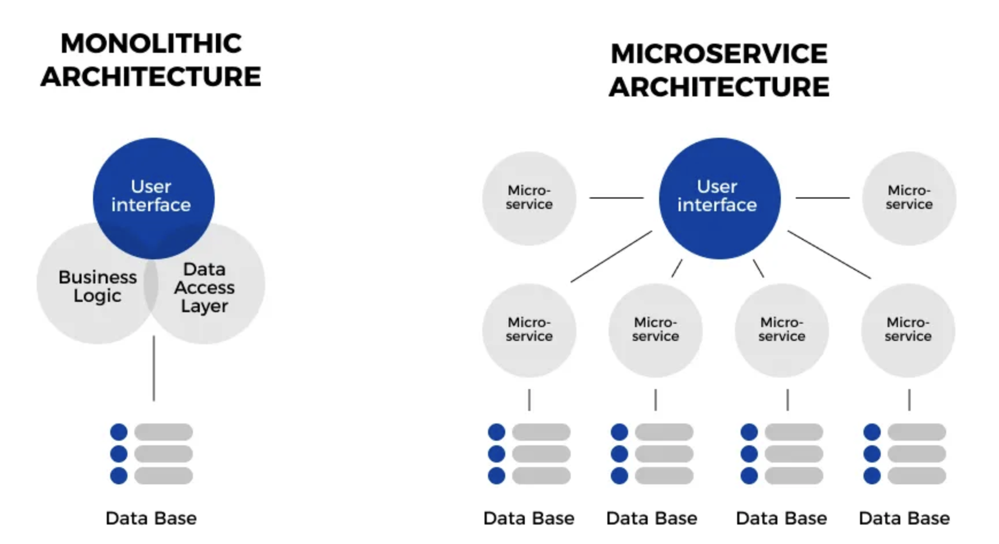
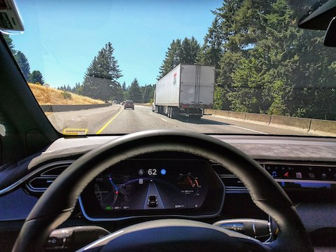
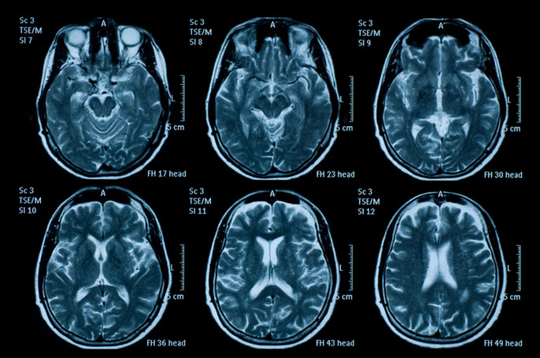
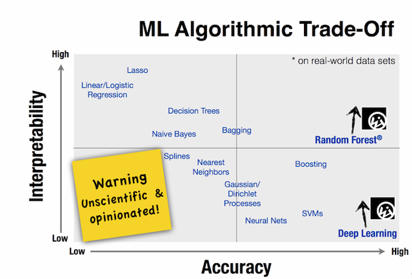

## After requirements...

<!-- .element: class="plain stretch" -->

----
## Learning Goals

* Describe the role of architecture and design between requirements and implementation
* Identify the different ML components and organize and prioritize their quality concerns for a given project
* Explain they key ideas behind decision trees and random forests and analyze consequences for various qualities
* Demonstrate an understanding of the key ideas of deep learning and how it drives qualities
* Plan and execute an evaluation of the qualities of alternative AI components for a given purpose

----
## Readings

Required reading: Hulten, Geoff. "Building Intelligent Systems: A
Guide to Machine Learning Engineering." (2018), Chapters 17 and 18

Recommended reading: Siebert, Julien, Lisa Joeckel, Jens Heidrich, Koji Nakamichi, Kyoko Ohashi, Isao Namba, Rieko Yamamoto, and Mikio Aoyama. “Towards Guidelines for Assessing Qualities of Machine Learning Systems.” In International Conference on the Quality of Information and Communications Technology, pp. 17–31. Springer, Cham, 2020.

---
# Recall: ML is a Component in a System in an Environment

----
## Recall: Systems Thinking

<!-- .element: class="plain stretch" -->

> A system is a set of inter-related components that work together in a particular environment to perform whatever functions are required to achieve the system's objective -- Donella Meadows

---
# Thinking like a Software Architect

<!-- .element: class="plain" -->

----
## From Requirements to Implementations...

We know what to build, but how? How to we meet the quality goals?

<!-- .element: class="plain" -->

**Software architecture:** Key design decisions, made early in the
  development, focusing on key product qualities

Architectural decisions are hard to change later

----
## Architecture Decisions: Examples

* What are the major components in the system? What does each
component do? 
* Where do the components live? Monolithic vs microservices?
* How do components communicate to each other? Synchronous vs
asynchronous calls?
* What API does each component publish? Who can access this API?
* Where does the ML inference happen? Client-side or server-side?
* Where is the telemetry data collected from the users stored?
* How large should the user database be? Centralized vs decentralized?
* ...and many others

----
## Software Architecture

> Architecture represents the set of **significant** **design** decisions that shape the form and the function of a system, where **significant** is measured by cost of change.
> -- [Grady Booch, 2006]

----
## How much Architecture/Design?

<!-- .element: class="stretch" -->

Software Engineering Theme: *Think before you code*

Like requirements: Slower initially, but upfront investment can prevent problems later and save overall costs

-> Focus on most important qualities early, but leave flexibility

----
## Quality Requirements Drive Architecture Design

Driven by requirements, identify most important qualities

Examples:
* Development cost, operational cost, time to release
* Scalability, availability, response time, throughput
* Security, safety, usability, fairness
* Ease of modifications and updates
* ML: Accuracy, ability to collect data, training latency

----
## Architecture Design Involves Quality Trade-offs

<!-- .element: class="stretch" -->

**Q. What are quality trade-offs between the two?**

<!-- references_ -->
[Image source](https://medium.com/javanlabs/micro-services-versus-monolithic-architecture-what-are-they-e17ddc8d3910)

----

## Why Architecture? ([Kazman et al. 2012](https://www.oreilly.com/library/view/software-architecture-in/9780132942799/?ar))

Represents earliest design decisions.

Aids in **communication** with stakeholders: Shows them “how” at a level they can understand, raising questions about whether it meets their needs

Defines **constraints** on implementation: Design decisions form “load-bearing walls” of application

Dictates **organizational structure**: Teams work on different components

Inhibits or enables **quality attributes**: Similar to design patterns

Supports **predicting** cost, quality, and schedule: Typically by predicting information for each component

Aids in software **evolution**: Reason about cost, design, and effect of changes

---
## Codifying Design Knowledge 

<!-- .element: class="stretch" -->

----
## System Decomposition

<!-- .element: class="stretch plain" -->

Identify components and their responsibilities

Establishes interfaces and team boundaries

----
### Common Components in ML-based Systems

* **Model inference service**: Uses model to make predictions for input data
* **ML pipeline**: Infrastructure to train/update the model
* **Monitoring**: Observe model and system
* **Data sources**: Manual/crowdsourcing/logs/telemetry/...
* **Data management**: Storage and processing of data, often at scale
* **Feature store**: Reusable feature engineering code, cached feature computations

----
## Common System-Wide Design Challenges

Separating concerns, understanding interdependencies
* e.g., anticipating/breaking feedback loops, conflicting needs of components

Facilitating experimentation, updates with confidence

Separating training and inference; closing the loop
* e.g., collecting telemetry to learn from user interactions

Learn, serve, and observe at scale or with resource limits
* e.g., cloud deployment, embedded devices

----
## Each system is different...

<!-- .element: class="stretch" -->

----
## Each system is different...

 
<!-- .element: class="stretch" -->

----
## Each system is different...

<!-- .element: style="width:700px" -->

----
## Each system is different...

<!-- .element: style="width:800px" -->

----
## System Decomposition

Each system is different, identify important components

Examples:
* Personalized music recommendations: microservice deployment in cloud, logging of user activity, nightly batch processing for inference, regular model updates, regular experimentation, easy fallback
* Transcription service: irregular user interactions, large model, expensive inference, inference latency not critical, rare model updates
* Autonomous vehicle: on-board hardware sets limits, real-time needs, safety critical, updates necessary, limited experimentation in practice, not always online
* Smart keyboard: privacy focused, small model, federated learning on user device, limited telemetry

---
# Scoping Relevant Qualities of ML Components

From System Quality Requirements to Component Quality Specifications

----
## Design Decision: ML Model Selection

How do I decide which ML algorithm to use for my project?

Criteria: Quality Attributes & Constraints

----
## Accuracy is not Everything

Beyond prediction accuracy, what qualities may be relevant for an ML component?

<!-- discussion -->

Note: Collect qualities on whiteboard

----
## Qualities of Interest?

Scenario: ML component for transcribing audio files 

<!-- .element: class="stretch" -->

Note: Which of the previously discussed qualities are relevant?
Which additional qualities may be relevant here?

Cost per transaction; how much does it cost to transcribe? How much do
we make?

----
## Qualities of Interest?

Scenario: Component for detecting lane markings in a vehicle

Note: Which of the previously discussed qualities are relevant?
Which additional qualities may be relevant here?

Realtime use

----
## Qualities of Interest?

Scenario: Component for detecting credit card frauds, as a service for banks

<!-- .element: class="stretch" -->

Note: Very high volume of transactions, low cost per transaction, frequent updates

Incrementality

<!-- Img src https://pixabay.com/photos/credit-card-payment-transaction-926862/ -->

----
## Common ML Qualities to Consider

* Accuracy
* Correctness guarantees? Probabilistic guarantees (--> symbolic AI)
* How many features?
* How much data needed? Data quality important?
* Incremental training possible?
* Training time, memory need, model size -- depending on training data volume and feature size
* Inference time, energy efficiency, resources needed, scalability
* Interpretability, explainability
* Robustness, reproducibility, stability
* Security, privacy, fairness

---
## Constraints and Tradeoffs

<!-- .element: class="stretch plain" -->

Notes:

How do I decide which ML algorithm to use for my project?

Criteria: Quality Attributes & Constraints

----
## Constraints

Constraints define the space of attributes for valid design solutions

<!-- .element: class="stretch plain" -->

Note: Design space exploration: The space of all possible designs (dotted rectangle) is reduced by several constraints on qualities of the system, leaving only a subset of designs for further consideration (highlighted center area).

----
## Types of Constraints

**Problem constraints**: Minimum required QAs for an acceptable product

**Project constraint**s: Deadline, project budget, available personnel/skills

**Design constraints**
* Type of ML task required (regression/classification)
* Available data
* Limits on computing resources, max. inference cost/time

----
## Constraints: Cancer Prognosis?

 
<!-- .element: class="stretch" -->

----
## Constraints: Music Recommendations?

 
<!-- .element: class="stretch" -->

----
## Trade-offs between ML algorithms

If there are multiple ML algorithms that satisfy the given constraints, which
one do we select?

Different ML qualities may conflict with each other; this requires
making a __trade-off__ between these qualities

Among the qualities of interest, which one(s) do we care the most
about?
* And which ML algorithm is most suitable for achieving those qualities?
* (Similar to requirements conflicts)

----
## Trade-offs: Cost vs Accuracy

<!-- colstart -->

<!-- .element: class="stretch" -->

<!-- col -->

_"We evaluated some of the new methods offline but the additional
accuracy gains that we measured did not seem to justify the
engineering effort needed to bring them into a production
environment.”_

<!-- colend -->

<!-- references_ -->

Amatriain & Basilico. [Netflix Recommendations: Beyond the 5 stars](https://netflixtechblog.com/netflix-recommendations-beyond-the-5-stars-part-1-55838468f429),
Netflix Technology Blog (2012)

----
## Trade-offs: Accuracy vs Interpretability

<!-- .element: class="stretch" -->

**Q. Examples where one is more important than the other?**

<!-- references_ -->

Bloom & Brink. [Overcoming the Barriers to Production-Ready Machine Learning
Workflows](https://conferences.oreilly.com/strata/strata2014/public/schedule/detail/32314), Presentation at O'Reilly Strata Conference (2014).

----
## Network Size

* 50 Layer ResNet network -- classifying 224x224 images into 1000 categories
  * 26 million weights, computes 16 million activations during inference, 168 MB to store weights as floats
* Google in 2012(!): 1TB-1PB of training data, 1 billion to 1 trillion parameters
* OpenAI’s GPT-2 (2019) -- text generation
  - 48 layers, 1.5 billion weights (~12 GB to store weights)
  - released model reduced to 117 million weights
  - trained on 7-8 GPUs for 1 month with 40GB of internet text from 8 million web pages
* OpenAI’s GPT-3 (2020): 96 layers, 175 billion weights, 700 GB in memory, $4.6M in approximate compute cost for training

Notes: https://lambdalabs.com/blog/demystifying-gpt-3/

----
## Cost & Energy Consumption

  <!-- colstart -->

| Consumption | CO2 (lbs) |
| - | - |
| Air travel, 1 passenger, NY↔SF | 1984 |
| Human life, avg, 1 year | 11,023 |
| American life, avg, 1 year | 36,156 |
| Car, avg incl. fuel, 1 lifetime | 126,000 |

<!-- col -->

| Training one model (GPU) | CO2 (lbs) |
| - | - |
| NLP pipeline (parsing, SRL) | 39 |
| w/ tuning & experimentation | 78,468 |
| Transformer (big) | 192 |
| w/ neural architecture search | 626,155 |

<!-- colend -->

<!-- references -->
Strubell, Emma, Ananya Ganesh, and Andrew McCallum. "[Energy and Policy Considerations for Deep Learning in NLP](https://arxiv.org/pdf/1906.02243.pdf)." In Proc. ACL, pp. 3645-3650. 2019.

----
## Cost & Energy Consumption

| Model | Hardware | Hours | CO2 | Cloud cost in USD |
| - | - | - | - | - |
| Transformer | P100x8 | 84 | 192 | 289–981 |
| ELMo | P100x3 | 336 | 262 | 433–1472 |
| BERT | V100x64 | 79 | 1438 | 3751–13K |
| NAS | P100x8 | 274,120 | 626,155 | 943K–3.2M |
| GPT-2 | TPUv3x32 | 168 | — | 13K–43K |
| GPT-3 |  |  | — | 4.6M |

<!-- references -->
Strubell, Emma, Ananya Ganesh, and Andrew McCallum. "[Energy and Policy Considerations for Deep Learning in NLP](https://arxiv.org/pdf/1906.02243.pdf)." In Proc. ACL, pp. 3645-3650. 2019.

---
# Summary

Software architecture focuses on early key design decisions, focused on key qualities

Between requirements and implementation

Decomposing the system into components, many ML components
 
Many qualities of interest, define metrics and operationalize

Constraints and tradeoff analysis for selecting ML techniques in production ML settings

----
## Further Readings

* Bass, Len, Paul Clements, and Rick Kazman. Software architecture in practice. Addison-Wesley Professional, 3rd edition, 2012.
* Yokoyama, Haruki. “Machine learning system architectural pattern for improving operational stability.” In 2019 IEEE International Conference on Software Architecture Companion (ICSA-C), pp. 267–274. IEEE, 2019.
* Serban, Alex, and Joost Visser. “An Empirical Study of Software Architecture for Machine Learning.” In Proceedings of the International Conference on Software Analysis, Evolution and Reengineering (SANER), 2022.
* Lakshmanan, Valliappa, Sara Robinson, and Michael Munn. Machine learning design patterns. O’Reilly Media, 2020.
* Lewis, Grace A., Ipek Ozkaya, and Xiwei Xu. “Software Architecture Challenges for ML Systems.” In 2021 IEEE International Conference on Software Maintenance and Evolution (ICSME), pp. 634–638. IEEE, 2021.
* Vogelsang, Andreas, and Markus Borg. “Requirements Engineering for Machine Learning: Perspectives from Data Scientists.” In Proc. of the 6th International Workshop on Artificial Intelligence for Requirements Engineering (AIRE), 2019.
* Habibullah, Khan Mohammad, Gregory Gay, and Jennifer Horkoff. "[Non-Functional Requirements for Machine Learning: An Exploration of System Scope and Interest](https://arxiv.org/abs/2203.11063)." arXiv preprint arXiv:2203.11063 (2022).

