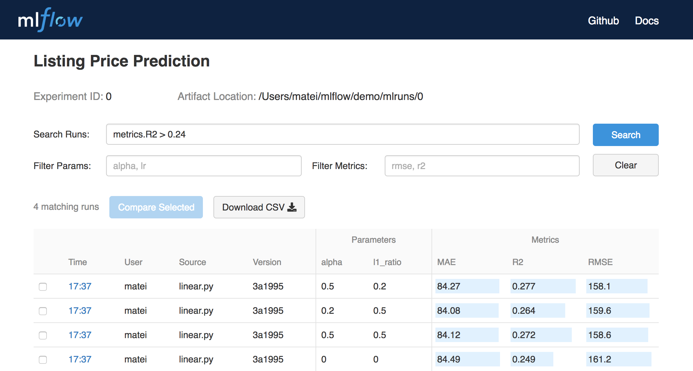
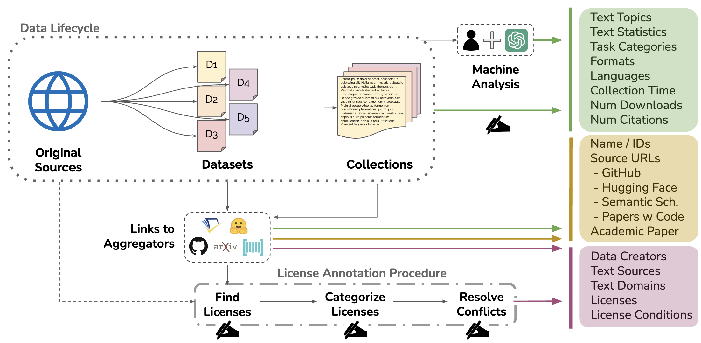
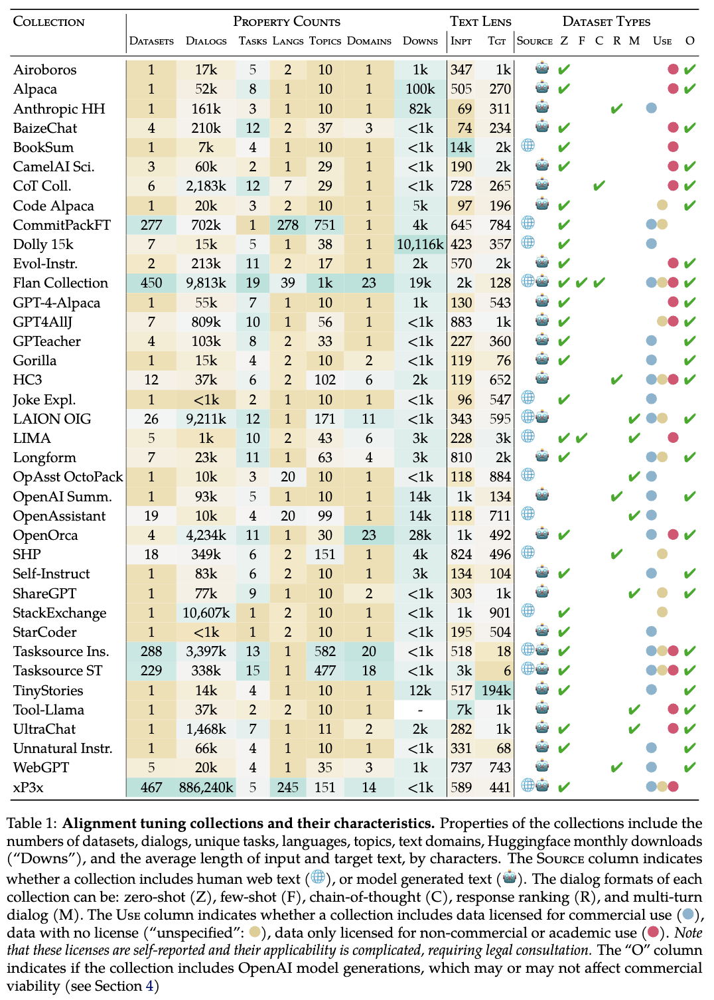
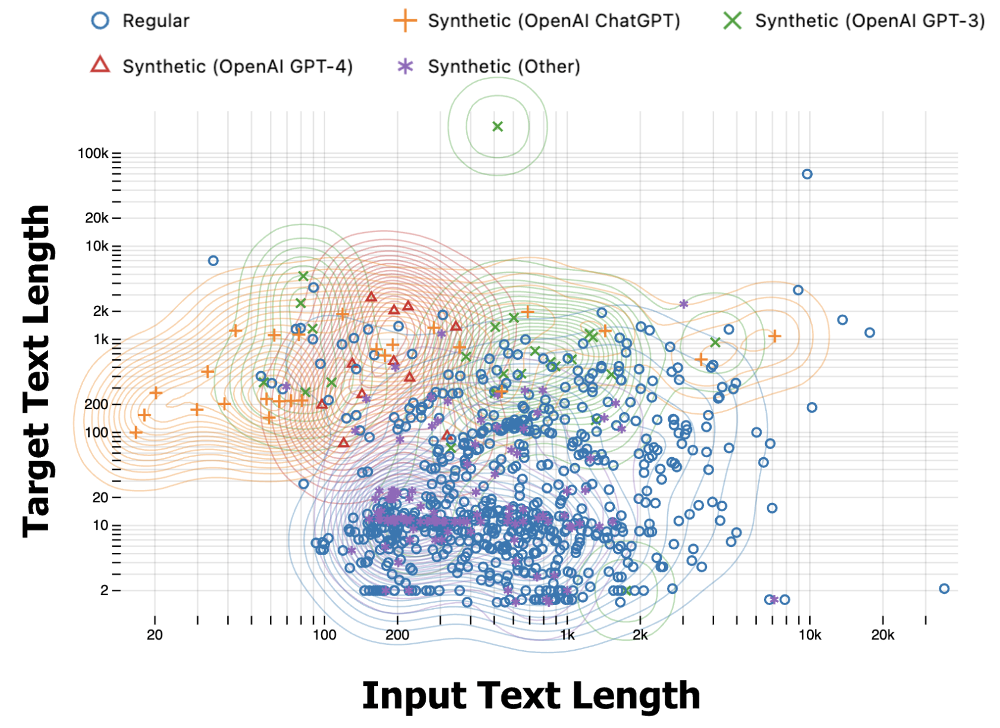
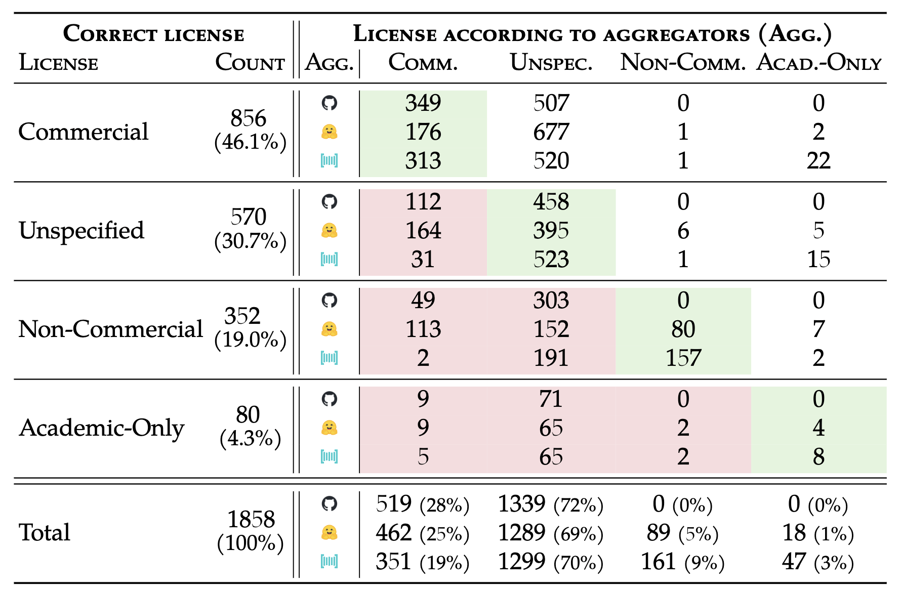
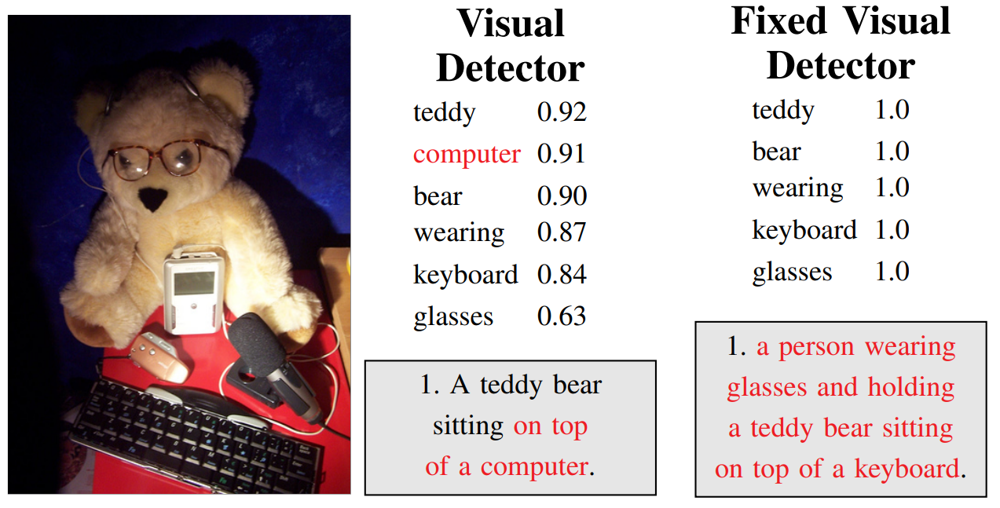
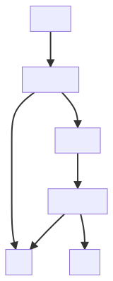

<!-- .element: class="titleslide"  data-background="../_chapterimg/20_provenance.jpg" -->
<div class="stretch"></div>

## Machine Learning in Production


# Versioning, Provenance, and Reproducability

<!-- image: https://commons.wikimedia.org/wiki/File:Kerlikowske_testifies_before_Senate_Finance_Committee_(26349370364).jpg -->

---
## Foundational Technology for Responsible Engineering


<!-- .element: class="plain stretch" -->


----
## Readings


Required readings

* 🗎 Sculley, D., Holt, G., Golovin, D., Davydov, E., Phillips, T., Ebner, D., Chaudhary, V., Young, M., Crespo, J.F. and Dennison, D., 2015. [Hidden Technical Debt in Machine Learning Systems](http://papers.nips.cc/paper/5656-hidden-technical-debt-in-machine-learning-systems.pdf). In Advances in neural information processing systems (pp. 2503-2511).

---

# Learning Goals

* Judge the importance of data provenance, reproducibility and explainability for a given system
* Create documentation for data dependencies and provenance in a given system
* Propose versioning strategies for data and models
* Design and test systems for reproducibility

---

# Case Study: Credit Scoring

----
<div class="tweet" data-src="https://twitter.com/dhh/status/1192540900393705474"></div>

----

<!-- colstart -->

<div class="tweet" data-src="https://twitter.com/dhh/status/1192945019230945280"></div>

<!-- col -->

* What model was used? Can we reproduce?
* What caused the issue? What data was used?

<!-- colend -->

----

<!-- .element: class="plain stretch" -->


----

## Debugging?

What went wrong? Where? How to fix?

<!-- discussion -->

----

## Debugging Questions beyond Interpretability

* Can we reproduce the problem?
* What were the inputs to the model?
* Which exact model version was used?
* What data was the model trained with?
* What pipeline code was the model trained with?
* Where does the data come from? How was it processed/extracted?
* Were other models involved? Which version? Based on which data?
* What parts of the input are responsible for the (wrong) answer? How can we fix the model?


----

## Breakout Discussion: Movie Predictions

<div class="smallish">

> Assume you are receiving complains that a child gets many recommendations about R-rated movies

In a group, discuss how you could address this in your own system and post to `#lecture`, tagging team members:

* How could you identify the problematic recommendation(s)?
* How could you identify the model that caused the prediction?
* How could you identify the training code and data that learned the model?
* How could you identify what training data or infrastructure code "caused" the recommendations?

</div>

<!-- references -->

K.G Orphanides. [Children's YouTube is still churning out blood, suicide and cannibalism](https://www.wired.co.uk/article/youtube-for-kids-videos-problems-algorithm-recommend). Wired UK, 2018; 
Kristie Bertucci. [16 NSFW Movies Streaming on Netflix](https://www.gadgetreview.com/16-nsfw-movies-streaming-on-netflix). Gadget Reviews, 2020


---
# Practical Data and Model Versioning

* Versioning the data
* Versioning the model

----
## Versioning Large Datasets

* Track the history of data
* Trace back the data used to train a model, even after we make some changes to the data

----
## How to Version Large Datasets?

```
InquiryID,CustomerID,InquiryDate,LoanType,LoanAmount,AccountStatus,PaymentStatus
1001,001,2020-01-15,Mortgage,250000,Open,Current
1002,002,2020-02-20,Auto Loan,20000,Closed,Paid Off
1003,003,2020-03-05,Credit Card,5000,Open,Late (30 days)
1004,004,2020-04-10,Personal Loan,10000,Open,Current
1005,005,2020-05-15,Student Loan,30000,Closed,Paid Off
1006,001,2020-06-20,Mortgage,200000,Open,Current
1007,002,2020-07-25,Credit Card,7000,Open,Late (60 days)
1008,003,2020-08-30,Auto Loan,15000,Closed,Paid Off
1009,004,2020-09-10,Personal Loan,8000,Open,Current
1010,005,2020-10-15,Credit Card,10000,Open,Late (90 days)
```

(example customer data from the credit scenario, can be TBs!)

----

## How to Version Large Datasets?

<!-- discussion -->

----
## Recall: Event Sourcing

* **Append only databases + offsets**
* Record edit events, never mutate data
* Compute current state from all past events, can reconstruct old state
* For efficiency, take state snapshots
* Similar to traditional database logs

```text
createUser(id=5, name="Christian", dpt="SCS")
updateUser(id=5, dpt="ISR")
deleteUser(id=5)
```

----
## Versioning Strategies for Datasets

1. Store copies of entire datasets (like Git), identify by checksum
2. Store deltas between datasets (like Mercurial)
3. History of individual database records (e.g. S3 bucket versions)
    - some databases specifically track provenance (who has changed what entry when and how)
    - specialized data science tools eg [Hangar](https://github.com/tensorwerk/hangar-py) for tensor data
4. Offsets in append-only database (like Kafka), identify by offset
5. Version pipeline to recreate derived datasets ("views", different formats)
    - e.g. version data before or after cleaning?


----
## Aside: Git Internals

<!-- .element: style="width:900px" -->

Git LFS -- still stores entire datasets, but just the pointer. Actual file is stored in a separate storage.

<!-- references -->

Scott Chacon and Ben Straub. [Pro Git](https://git-scm.com/book/en/v2/Git-Internals-Git-References). 2014

----
## Versioning Models

<!-- discussion -->

----
## Versioning Models

Usually no meaningful delta/compression, version as binary objects

Any system to track versions of blobs

----
## Versioning Models: Multiple Parts!


<!-- .element: class="plain" style="width: 900px" -->

Associate model version with:
* pipeline code version
* data version
* hyperparameters

----
## ML Versioning Tools (MLOps)

Tracking **data**, **pipeline**, and **model versions**

Modeling pipelines: inputs and outputs and their versions
  - automatically tracks how data is used and transformed

Often tracking also metadata about versions
  - Accuracy
  - Training time
  - ...


----
## Example: ModelDB

- Low complexity
+ Your responsibility to design what to log and when!

```python
from verta import Client
client = Client("http://localhost:3000")

proj = client.set_project("My first ModelDB project")
expt = client.set_experiment("Default Experiment")

# log the first run
run = client.set_experiment_run("First Run")
run.log_hyperparameters({"regularization" : 0.5})
run.log_dataset_version("training_and_testing_data", dataset_version)
model1 = # ... model training code goes here
run.log_metric('accuracy', accuracy(model1, validationData))
run.log_model(model1)

# log the second run
run = client.set_experiment_run("Second Run")
run.log_hyperparameters({"regularization" : 0.8})
run.log_dataset_version("training_and_testing_data", dataset_version)
model2 = # ... model training code goes here
run.log_metric('accuracy', accuracy(model2, validationData))
run.log_model(model2)
```


----
## Example w/ Metadata: Experiment Tracking

Log information within pipelines: **hyperparameters used**, **evaluation results**, and **model files**


<!-- .element: class="stretch" -->

Many tools: MLflow, ModelDB, Neptune, TensorBoard, Weights & Biases, Comet.ml, ...

Note: Image from
Matei Zaharia. [Introducing MLflow: an Open Source Machine Learning Platform](https://databricks.com/blog/2018/06/05/introducing-mlflow-an-open-source-machine-learning-platform.html), 2018


----
## Example: DVC (Data Version Control)

```sh
dvc add images
dvc run -d images -o model.p cnn.py
dvc remote add myrepo s3://mybucket
dvc push
```

* Tracks models and datasets, built on Git
* Define a sequence of steps (e.g. data processing, training, evaluation) in a reproducible pipeline, incrementalization
* Orchestrates learning in cloud resources: Detect changes in any step and re-run only the necessary parts when there’s an update


https://dvc.org/

----
## DVC Example

- Higher complexity and constraints
+ More automation and less manual work

```yaml
stages:
  features:
    cmd: jupyter nbconvert --execute featurize.ipynb
    deps:
      - data/clean
    params:
      - levels.no
    outs:
      - features
    metrics:
      - performance.json
  training:
    desc: Train model with Python
    cmd:
      - pip install -r requirements.txt
      - python train.py --out ${model_file}
    deps:
      - requirements.txt
      - train.py
      - features
    outs:
      - ${model_file}:
          desc: My model description
    plots:
      - logs.csv:
          x: epoch
          x_label: Epoch
    meta: 'For deployment'
    # User metadata and comments are supported
```


 


----
## Google's Goods

Automatically derive data dependencies from system log files

Track metadata for each table

No manual tracking/dependency declarations needed
 
Requires homogeneous infrastructure

Similar systems for tracking inside databases, MapReduce, Sparks, etc.


----
## Versioning Dependencies

Pipelines depend on many frameworks and libraries

Ensure reproducible builds
  - Declare versioned dependencies from stable repository (e.g. requirements.txt + pip)
  - Avoid floating versions
  - Optionally: commit all dependencies to repository ("vendoring")

Optionally: Version entire environment (e.g. Docker container)


Test build/pipeline on independent machine (container, CI server, ...)


----
## From Model Versioning to Deployment

Decide which model version to run where
  - automated deployment and rollback (cf. canary releases)
  - Kubernetis, Cortex, BentoML, ...

Track which prediction has been performed with which model version (logging)


----

## Logging and Audit Traces


**Key goal:** If a customer complains about an interaction, can we reproduce the prediction with the right model? Can we debug the model's pipeline and data? Can we reproduce the model?

* Version everything
* Record every model evaluation with model version
* Append only, backed up


```
<date>,<model>,<model version>,<feature inputs>,<output>
<date>,<model>,<model version>,<feature inputs>,<output>
<date>,<model>,<model version>,<feature inputs>,<output>
```


----
## Logging for Composed Models


*Ensure all predictions are logged*


<!-- .element: class="plain stretch" -->


---

# Provenance Tracking

*Historical record of data and its origin*

----

## Data Provenance

<!-- colstart -->
* Track origin of all data
    - Collected where?
    - Modified by whom, when, why?
    - Extracted from what other data or model or algorithm?
* ML models often based on data drived from many sources through many steps, including other models
<!-- col -->


<!-- .element: class="plain stretch" -->

<!-- colend -->


----
## Versioning vs Provenance

<div class="small">

| Feature               | Data Versioning                              | Data Provenance                                 |
|-----------------------|----------------------------------------------|-------------------------------------------------|
| **Purpose**           | Tracks changes in data over time             | Documents data's origin, lifecycle, usage   |
| **Primary Focus**     | Data states / changes between versions     | Data lineage, sources, and transformations      |
| **Granularity**       | Focuses on entire datasets or files          | Tracks individual data entries and transformations |
| **Application**       | Rollbacks, collaborative editing     | Compliance, auditing, trust, and traceability   |
| **Example**           | Version 1.0, 1.1, 2.0 of a dataset           | Source, timestamp, consent for each entry  |

</div>

----
## Excursion: Provenance Tracking in Databases

Whenever value is changed, record:
  - who changed it
  - time of change
  - history of previous values
  - possibly also justifcation of why

Embedded as feature in some databases or implemented in business logic

Possibly signing with cryptographic methods


----

## Tracking Data Lineage

Document all data sources

Identify all model dependencies and flows

Ideally model all data and processing code

Avoid "visibility debt"

(Advanced: Use infrastructure to automatically capture/infer dependencies and flows as in [Goods](http://research.google.com/pubs/archive/45390.pdf))


----

## Example: Data Provenance Initiative

Key idea: Need to recover data provenance for existing datasets!


<!-- .element: class="plain" style="width: 900px" -->


<!-- references -->

Longpre  et al. "[A large-scale audit of dataset licensing and attribution in AI.](https://www.nature.com/articles/s42256-024-00878-8)" Nature Machine Intelligence 2024


----

## Example: Data Provenance Initiative

<!-- colstart -->

Can make many interesting observations...

<!-- col -->

<!-- .element: class="plain stretch"  -->


<!-- colend -->


<!-- references -->

Longpre  et al. "[A large-scale audit of dataset licensing and attribution in AI.](https://www.nature.com/articles/s42256-024-00878-8)" Nature Machine Intelligence 2024


----

## Example: Data Provenance Initiative

<!-- colstart -->

Can make many interesting observations, on creators...

* Most data come from academic, then industry labs
* Also from Wikimedia, then social media

<!-- col -->

<!-- .element: class="plain stretch"  -->


<!-- colend -->


<!-- references -->

Longpre  et al. "[A large-scale audit of dataset licensing and attribution in AI.](https://www.nature.com/articles/s42256-024-00878-8)" Nature Machine Intelligence 2024


----

## Example: Data Provenance Initiative

<!-- colstart -->

Can make many interesting observations, on data source...

* More synthesized datasets
* Very different distribution


<!-- col -->

<!-- .element: class="plain stretch"  -->


<!-- colend -->


<!-- references -->

Longpre  et al. "[A large-scale audit of dataset licensing and attribution in AI.](https://www.nature.com/articles/s42256-024-00878-8)" Nature Machine Intelligence 2024


----

## Example: Data Provenance Initiative

<!-- colstart -->

Observe issues in data provenance: Many datasets are annotated to have more permissive licenses than they actually have!

<!-- col -->

<!-- .element: class="plain stretch"  -->


<!-- colend -->


<!-- references -->

Longpre  et al. "[A large-scale audit of dataset licensing and attribution in AI.](https://www.nature.com/articles/s42256-024-00878-8)" Nature Machine Intelligence 2024


----

## Example: Data Provenance Initiative

<!-- colstart -->

Make interesting observations on what you can and cannot train models on (blue is commerially usable, red is not)

<!-- col -->

<!-- .element: class="plain" style="width: 800px" -->


<!-- colend -->


<!-- references -->

Longpre  et al. "[A large-scale audit of dataset licensing and attribution in AI.](https://www.nature.com/articles/s42256-024-00878-8)" Nature Machine Intelligence 2024

----
## Feature Provenance

How are features extracted from raw data?
  - during training
  - during inference

Has feature extraction changed since the model was trained?

Recommendation: Modularize and version feature extraction code

**Example?**

----
## Feature Provenance

How are features extracted from raw data?
  - during training
  - during inference

Has feature extraction changed since the model was trained?

Recommendation: Modularize and version feature extraction code

**Example?**

----
## DVC Example

```yaml
stages:
  features:
    cmd: jupyter nbconvert --execute featurize.ipynb
    deps:
      - data/clean
    params:
      - levels.no
    outs:
      - features
    metrics:
      - performance.json
  training:
    desc: Train model with Python
    cmd:
      - pip install -r requirements.txt
      - python train.py --out ${model_file}
    deps:
      - requirements.txt
      - train.py
      - features
    outs:
      - ${model_file}:
          desc: My model description
    plots:
      - logs.csv:
          x: epoch
          x_label: Epoch
    meta: 'For deployment'
    # User metadata and comments are supported
```


----
## Advanced Practice: Feature Store

Stores feature extraction code as functions, versioned

Catalog features to encourage reuse

Compute and cache features centrally

Use same feature used in training and inference code

Advanced: Immutable features -- never change existing features, just add new ones (e.g., creditscore, creditscore2, creditscore3)


----
## Model Provenance

How was the model trained?

What data? What library? What hyperparameter? What code?

Ensemble of multiple models?


----
## Unified Model Record (UMR)

UMR tracks the entire lifecycle of a model, including design, development, testing, and deployment phases.

<div class="small">

| Feature                     | Model Card                                          | **Unified Model Record (UMR)**                               |
|-----------------------------|-----------------------------------------------------|----------------------------------------------------------|
| **Purpose**                 | Summarizes model's purpose, limitations, and usage  | Tracks full model lifecycle and operations               |
| **Content Focus**           | Usage guidelines, ethical considerations, limitations | Technical specs, lifecycle history, compliance records  |
| **Compliance**              | Limited focus on regulatory compliance              | Aligned with governance and regulatory standards         |
| **Maintenance**             | Updated occasionally, typically per major update    | Continuous updates with lifecycle events and audits      |

</div>

https://modelrecord.com/


----


<!-- .element: class="plain stretch" -->


----
## In Real Systems: Tracking Provenance Across Multiple Models


<!-- .element: class="plain stretch" -->

*Version all models involved!*


<!-- references_ -->
Example adapted from Jon Peck. [Chaining machine learning models in production with Algorithmia](https://algorithmia.com/blog/chaining-machine-learning-models-in-production-with-algorithmia). Algorithmia blog, 2019


----
## Complex Model Composition: ML Models for Feature Extraction


<!-- .element: class="stretch" -->

<!-- references_ -->
Image: Peng, Zi, Jinqiu Yang, Tse-Hsun Chen, and Lei Ma. "A first look at the integration of machine learning models in complex autonomous driving systems: a case study on Apollo." In Proc. FSE. 2020.

----
## How about Provenance for Foundation Models?

<!-- discussion -->

----
## Complicated Foundation Models


<!-- .element: class="stretch" -->

<!-- references_ -->
Wang, Keyu, et al. "Mitigating Downstream Model Risks via Model Provenance." arXiv 2024


----
## Summary: Provenance

Data provenance

Feature provenance

Model provenance


----

## Breakout Discussion: Movie Predictions (Revisited)

> Assume you are receiving complains that a child gets mostly recommendations about R-rated movies

Discuss again, updating the previous post in `#lecture`:

* How would you identify the model that caused the prediction?
* How would you identify the code and dependencies that trained the model?
* How would you identify the training data used for that model?


---
# Reproducability

----
## On Terminology

**Replicability:** ability to reproduce results exactly
* Ensures everything is clear and documented
* All data, infrastructure shared; requires determinism

**Reproducibility:** the ability of an experiment to be repeated with minor differences, achieving a consistent expected result
* In science, reproducing important to gain confidence
* many different forms distinguished: conceptual, close, direct, exact, independent, literal, nonexperiemental, partial, retest, ...

<!-- references -->

Juristo, Natalia, and Omar S. Gómez. "[Replication of software engineering experiments](https://www.researchgate.net/profile/Omar_S_Gomez/publication/221051163_Replication_of_Software_Engineering_Experiments/links/5483c83c0cf25dbd59eb1038/Replication-of-Software-Engineering-Experiments.pdf)." In Empirical software engineering and verification, pp. 60-88. Springer, Berlin, Heidelberg, 2010.

<!-- .element: class="cornerimg" -->


----
## "Reproducibility" of Notebooks
<div class="small">

<!-- colstart -->

2019 Study of 1.4M notebooks on GitHub:
- 21% had unexecuted cells
- 36% executed cells out of order
- 14% declare dependencies
- success rate for installing dependencies <40% (version issues, missing files)
- notebook execution failed with exception in >40% (often ImportError, NameError, FileNotFoundError)
- only 24% finished execution without problem, of those 75% produced different results
  
<!-- col -->

2020 Study of 936 executable notebooks:
- 40% produce different results due to nondeterminism (randomness without seed)
- 12% due to time and date
- 51% due to plots (different library version, API misuse)
- 2% external inputs (e.g. Weather API)
- 27% execution environment (e.g., Python package versions)


<!-- colend -->
</div>

<!-- references -->
🗎 Pimentel, João Felipe, et al. "A large-scale study about quality and reproducibility of jupyter notebooks." In Proc. MSR, 2019. and 
🗎 Wang, Jiawei, K. U. O. Tzu-Yang, Li Li, and Andreas Zeller. "Assessing and restoring reproducibility of Jupyter notebooks." In Proc. ASE, 2020.

----
## Practical Reproducibility

Ability to generate the same research results or predictions 

Recreate model from data

Requires versioning of data and pipeline (incl. hyperparameters and dependencies)


----
## Nondeterminism

* Model inference almost always deterministic for a given model
* Many machine learning algorithms are nondeterministic
    - Nondeterminism in neural networks initialized from random initial weights
    - Nondeterminism from distributed computing, random forests
    - Determinism in linear regression and decision trees
* Many notebooks and pipelines contain nondeterminism
  - Depend on time or snapshot of online data (e.g., stream)
  - Initialize random seed
  - Different memory addresses for figures
* Different library versions installed on the machine


----
## Recommendations for Reproducibility

* Version pipeline and data (see above)
* Document each step   
    - document intention and assumptions of the process (not just results)
    - e.g., document why data is cleaned a certain way
    - e.g., document why certain parameters chosen
* Ensure determinism of pipeline steps (-> test)
* Modularize and test the pipeline
* Containerize infrastructure -- see MLOps


---
# Summary

Provenance is important for debugging and accountability

Data provenance, feature provenance, model provenance

Reproducibility vs replicability

*Version everything!*
  - Strategies for data versioning at scale
  - Version the entire pipeline and dependencies
  - Adopt a pipeline view, modularize, automate
  - Containers and MLOps, many tools

----
## Further Readings

* Sugimura, Peter, and Florian Hartl. “Building a Reproducible Machine Learning Pipeline.” *arXiv preprint arXiv:1810.04570* (2018).
* Chattopadhyay, Souti, Ishita Prasad, Austin Z. Henley, Anita Sarma, and Titus Barik. “[What’s Wrong with Computational Notebooks? Pain Points, Needs, and Design Opportunities](https://web.eecs.utk.edu/~azh/pubs/Chattopadhyay2020CHI_NotebookPainpoints.pdf).” In Proceedings of the CHI Conference on Human Factors in Computing Systems, 2020.
* Sculley, D, et al. “[Hidden technical debt in machine learning systems](http://papers.nips.cc/paper/5656-hidden-technical-debt-in-machine-learning-systems.pdf).” In Advances in neural information processing systems, pp. 2503–2511. 2015.


---

# Bonus: Debugging and Fixing Models

<!-- references -->

See also Hulten. Building Intelligent Systems. Chapter 21

See also Nushi, Besmira, Ece Kamar, Eric Horvitz, and Donald Kossmann. "[On human intellect and machine failures: troubleshooting integrative machine learning systems](http://erichorvitz.com/human_repair_AI_pipeline.pdf)." In *Proceedings of the Thirty-First AAAI Conference on Artificial Intelligence*, pp. 1017-1025. 2017.


----
## Recall: Composing Models: Ensemble and metamodels


<!-- .element: class="plain" -->

----
## Recall: Composing Models: Decomposing the problem, sequential


<!-- .element: class="plain" -->

----
## Recall: Composing Models: Cascade/two-phase prediction


<!-- .element: class="plain" -->


----
## Decomposing the Image Captioning Problem?


Note: Using insights of how humans reason: Captions contain important objects in the image and their relations. Captions follow typical language/grammatical structure

----
## State of the Art Decomposition (in 2015)


<!-- .element: class="plain stretch" -->

<!-- references_ -->
Example and image from: Nushi, Besmira, Ece Kamar, Eric Horvitz, and Donald Kossmann. "[On human intellect and machine failures: troubleshooting integrative machine learning systems](http://erichorvitz.com/human_repair_AI_pipeline.pdf)." In Proc. AAAI. 2017.


----
## Blame assignment?


<!-- .element: class="stretch" -->

<!-- references_ -->
Example and image from: Nushi, Besmira, Ece Kamar, Eric Horvitz, and Donald Kossmann. "[On human intellect and machine failures: troubleshooting integrative machine learning systems](http://erichorvitz.com/human_repair_AI_pipeline.pdf)." In Proc. AAAI. 2017.

----
## Nonmonotonic errors


<!-- .element: class="stretch" -->

<!-- references_ -->
Example and image from: Nushi, Besmira, Ece Kamar, Eric Horvitz, and Donald Kossmann. "[On human intellect and machine failures: troubleshooting integrative machine learning systems](http://erichorvitz.com/human_repair_AI_pipeline.pdf)." In Proc. AAAI. 2017.


----

## Chasing Bugs

* Update, clean, add, remove data
* Change modeling parameters
* Add regression tests
* Fixing one problem may lead to others, recognizable only later

----

## Partitioning Contexts

<!-- colstart -->
* Separate models for different subpopulations
* Potentially used to address fairness issues
* ML approaches typically partition internally already

<!-- col -->

<!-- .element: class="plain" -->

<!-- colend -->
----

## Overrides
<!-- colstart -->
* Hardcoded heuristics (usually created and maintained by humans) for special cases
* Blocklists, guardrails
* Potential neverending attempt to fix special cases

<!-- col -->

<!-- .element: class="plain" -->

<!-- colend -->
 

----
## Ideas?

<!-- discussion -->
