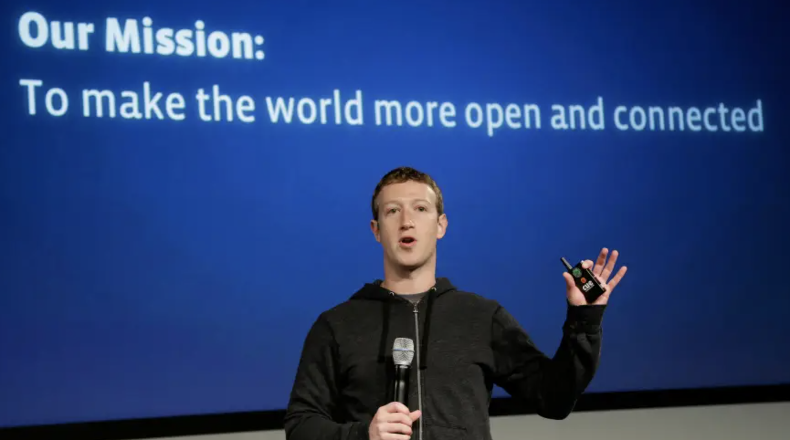
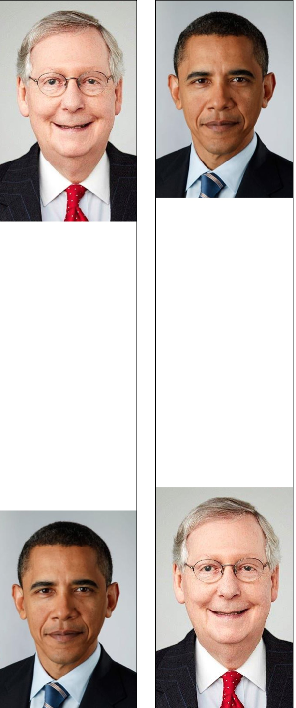
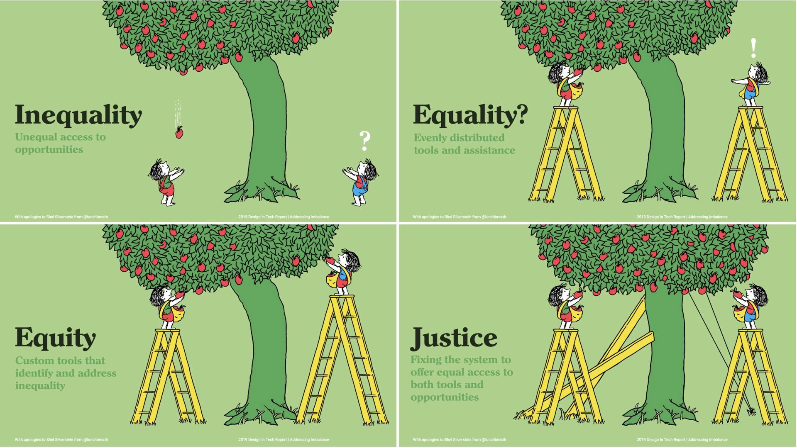
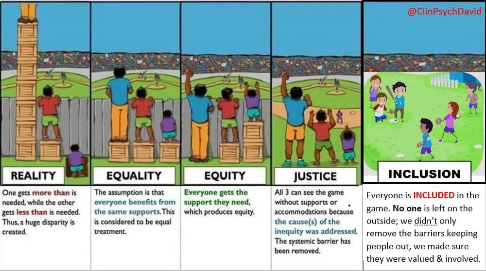
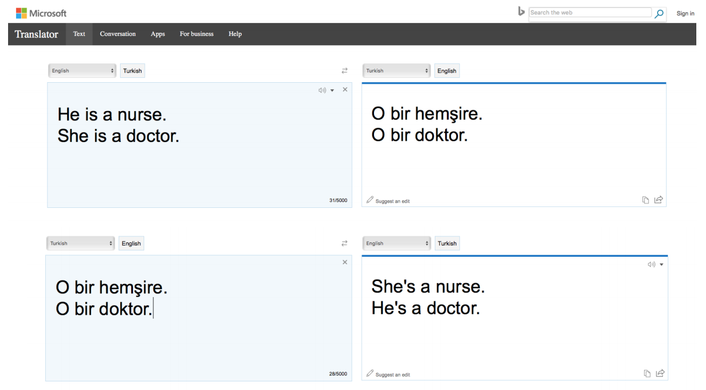

----
## Changing directions...

<!-- .element: class="plain stretch" -->

----
# Readings

R. Caplan, J. Donovan, L. Hanson, J.
Matthews. "Algorithmic Accountability: A Primer", Data & Society
(2018).

----
# Learning Goals

* Review the importance of ethical considerations in designing AI-enabled systems
* Recall basic strategies to reason about ethical challenges
* Diagnose potential ethical issues in a given system
* Understand the types of harm that can be caused by ML
* Understand the sources of bias in ML

---
# Why Fairness?

----
## Many interrelated issues:

* Ethics
* Fairness
* Justice
* Discrimination
* Safety
* Privacy
* Security
* Transparency
* Accountability

*Each is a deep and nuanced research topic. We focus on survey of some key issues.*

----

<!-- colstart -->

<!-- col -->

*In 2015, Shkreli received widespread criticism [...] obtained the manufacturing license for the antiparasitic drug Daraprim and raised its price from USD 13.5 to 750 per pill [...] referred to by the media as "the most hated man in America" and "Pharma Bro".* -- [Wikipedia](https://en.wikipedia.org/wiki/Martin_Shkreli)

"*I could have raised it higher and made more profits for our shareholders. Which is my primary duty.*" -- Martin Shkreli

<!-- colend -->

Note: Image source: https://en.wikipedia.org/wiki/Martin_Shkreli#/media/File:Martin_Shkreli_2016.jpg

----
## Terminology

**Legal** = in accordance to societal laws
  - systematic body of rules governing society; set through government
  - punishment for violation

**Ethical** = following moral principles of tradition, group, or individual
  - branch of philosophy, science of a standard human conduct
  - professional ethics = rules codified by professional organization
  - no legal binding, no enforcement beyond "shame"
  - high ethical standards may yield long term benefits through image and staff loyalty

<!-- .element: class="cornerimg" -->

----
## Big Disclaimer

Legality is obviously a locale-specific concern.

What is _ethical_ (and how we know) is a very complicated question.
* Whether there exists ground-truth ethics is a point of philosophical debate. 
* Often informed by context/culture/etc.

We adopt a generally US-centric perspective for much of this discussion. 
* ...Because that's where we are.
* But given the global reach of software, tread with care.

Note: GDPR is an easy example

----
## With a few lines of code...

Developers have substantial power in shaping products, and software has substantial power over human lives. 

Small design decisions can have substantial impact (safety, security,
discrimination, ...) -- not always deliberate

Our view: We have both **legal & ethical** responsibilities to anticipate mistakes,
think through their consequences, and build in mitigations!

----
## Example: Social Media

<!-- .element: class="stretch" -->

*What is the (real) organizational objective of the company?*

----
## Optimizing for Organizational Objective

<!-- colstart -->
How do we maximize the user engagement? Examples:
  - Infinite scroll: Encourage non-stop, continual use
  - Personal recommendations: Suggest news feed to increase engagement
  - Push notifications: Notify disengaged users to return to the app

<!-- col -->

<!-- .element: style="width:300px" -->

<!-- colend -->

----
## Addiction

<!-- .element: class="stretch" -->

* 210M people worldwide addicted to social media
* 71% of Americans sleep next to a mobile device
* ~1000 people injured **per day** due to distracted driving (USA)

<!-- references_ -->
https://www.flurry.com/blog/mobile-addicts-multiply-across-the-globe/; 
https://www.cdc.gov/motorvehiclesafety/Distracted_Driving/index.html

----
## Mental Health

<!-- .element: class="stretch" -->

* 35% of US teenagers with low social-emotional well-being have been bullied on social media.
* 70% of teens feel excluded when using social media.

<!-- references_ -->
https://leftronic.com/social-media-addiction-statistics

----
## Disinformation & Polarization

<!-- .element: class="stretch" -->

----
## Discrimination (as a side effect...)

<!-- colstart -->

<!-- .element: class="stretch" -->

<!-- col -->

<!-- .element: style="width: 220px" -->

<!-- colend -->

----
## Who's to blame?

<!-- .element: class="stretch" -->

*Are these companies intentionally trying to cause harm? If not,
  what are the root causes of the problem?*

----
## Liability?

> The software is provided “as is”, without warranty of any kind, express or implied, including but not limited to the warranties of merchantability, fitness for a particular purpose and noninfringement. In no event shall the authors or copyright holders be liable for any claim, damages or other liability, whether in an action of contract, tort or otherwise, arising from, out of or in connection with the software or the use or other dealings in the software.

Note: Software companies have usually gotten away with claiming no liability for their products

----
## Some Challenges

  <!-- colstart -->

*Misalignment between organizational goals & societal values*
  * Financial incentives often dominate other goals ("grow or die")

*Hardly any regulation*
  * Often, little legal consequences for causing negative impact (with exceptions based on domain)
  * Poor understanding of socio-technical systems by policy makers 

<!-- col -->

*Engineering challenges, at system- & ML-level*
  * Difficult to clearly define or measure ethical values
  * Difficult to anticipate all possible usage contexts
  * Difficult to anticipate impact of feedback loops
  * Difficult to prevent malicious actors from abusing the system
  * Difficult to interpret output of ML and make ethical decisions

  <!-- colend -->
  
**These problems have long existed, but are being
  rapidly exacerbated by the widespread use of ML**

**There are ML-specific techniques/concerns with respect to these issues.**

----
## Responsible Engineering Matters

Engineers have substantial power in shaping products and outcomes

Serious individual and societal harms possible from (a) negligence and (b) malicious designs 
* Safety, mental health, weapons
* Security, privacy
* Manipulation, addiction, surveilance, polarization
* Job loss, deskilling
* Discrimination

----
## "I don't care about ethics, I just want to make money."

Regulations apply in many domains, including those where ML is "hot"
* Health care, finance, real estate

Bad PR can be bad for your bottom line. 

----
## Responsible Engineering in this Course

Key areas of concern
* Fairness
* Safety
* Security and privacy
* Transparency and accountability

Technical infrastructure concepts
* Interpretability and explainability
* Versioning, provenance, reproducibility

---
# Fairness

----
## Dividing a Pie?

<!-- colstart -->

* Equal slices for everybody
* Bigger slices for active bakers
* Bigger slices for inexperienced/new members (e.g., children)
* Bigger slices for hungry people
* More pie for everybody, bake more

*(Not everybody contributed equally during baking, not everybody is equally hungry)*

<!-- col -->

<!-- colend -->

----
## What is fair?

> Fairness discourse asks questions about how to treat people and whether treating different groups of people differently is ethical. If two groups of people are systematically treated differently, this is often considered unfair.

----
## Regulated domains (US)

* Credit (Equal Credit Opportunity Act)
* Education (Civil Rights Act of 1964; Education Amendments of 1972)
* Employment (Civil Rights Act of 1964)
* Housing (Fair Housing Act)
* ‘Public Accommodation’ (Civil Rights Act of 1964)

Extends to marketing and advertising; not limited to final decision

<!-- references -->
Barocas, Solon and Moritz Hardt. "[Fairness in machine learning](https://mrtz.org/nips17/#/)." NIPS Tutorial 1 (2017).

----
## Legally protected classes (US)

- Race ([Civil Rights Act of 1964](https://en.wikipedia.org/wiki/Civil_Rights_Act_of_1964))
- Religion ([Civil Rights Act of 1964](https://en.wikipedia.org/wiki/Civil_Rights_Act_of_1964))
- National origin ([Civil Rights Act of 1964](https://en.wikipedia.org/wiki/Civil_Rights_Act_of_1964))
- Sex, sexual orientation, and gender identity ([Equal Pay Act of 1963](https://en.wikipedia.org/wiki/Equal_Pay_Act_of_1963), [Civil Rights Act of 1964](https://en.wikipedia.org/wiki/Civil_Rights_Act_of_1964), and [Bostock v. Clayton](https://en.wikipedia.org/wiki/Bostock_v._Clayton_County))
- Age (40 and over, [Age Discrimination in Employment Act of 1967](https://en.wikipedia.org/wiki/Age_Discrimination_in_Employment_Act_of_1967))
- Pregnancy ([Pregnancy Discrimination Act of 1978](https://en.wikipedia.org/wiki/Pregnancy_Discrimination_Act))
- Familial status (preference for or against having children, [Civil Rights Act of 1968](https://en.wikipedia.org/wiki/Civil_Rights_Act_of_1968))
- Disability status ([Rehabilitation Act of 1973](https://en.wikipedia.org/wiki/Rehabilitation_Act_of_1973); [Americans with Disabilities Act of 1990](https://en.wikipedia.org/wiki/Americans_with_Disabilities_Act_of_1990))
- Veteran status ([Vietnam Era Veterans’ Readjustment Assistance Act of 1974](https://en.wikipedia.org/wiki/Vietnam_Era_Veterans'_Readjustment_Assistance_Act); [Uniformed Services Employment and Reemployment Rights Act of 1994](https://en.wikipedia.org/wiki/Uniformed_Services_Employment_and_Re-employment_Rights_Act_of_1994))
- Genetic information ([Genetic Information Nondiscrimination Act of 2008](https://en.wikipedia.org/wiki/Genetic_Information_Nondiscrimination_Act))

<!-- references -->

https://en.wikipedia.org/wiki/Protected_group

----
## Common framing: Equality vs Equity vs Justice

<!-- .element: class="stretch" -->

----
## Equality vs Equity vs Justice

<!-- .element: class="stretch" -->

----
## Caveat: Something can be fair but still unethical (Thanos)!

----
## Not all discrimination is harmful

<!-- .element: class="stretch" -->

* Loan lending: Gender discrimination is illegal.
* Medical related: Gender-specificity may be desirable (women generally pay less for life insurance than men, since they tend to live longer.)

----
## Not all discrimination is harmful

<!-- .element: class="stretch" -->

* Discrimination is a __domain-specific__ concept 
  - ML models discriminate based on input data by construction. 
  - There are real differences between two groups, it might not be fair to ignore them
  - The problem is _unjustified_ differentiation; i.e., discriminating on factors that should not matter

----
## Fairness vs. bias vs. harm

Fairness is best understood as a **societal or cultural concept**.

Bias, in discussing ML, can be understood as a **technological or algorithmic
concept**; it is often discussed in terms of its negative effects.
* Whether bias is harmful or unfair is not something that can be decided algorithmically.

Useful definition/framework defines algorithmic bias as "a skew that produces a
type of harm."

<!-- references -->

Kate Crawford. “The Trouble With Bias”, NeurIPS Keynote (2017).

----
## Types of Harm on Society

__Harms of allocation__: Withhold opportunities or resources

__Harms of representation__: Reinforce stereotypes, subordination along
  the lines of identity

<!-- references -->

Kate Crawford. “The Trouble With Bias”, NeurIPS Keynote (2017).

----
## Harms of Allocation

* Withhold opportunities or resources
* Poor quality of service, degraded user experience for certain groups

<!-- .element: class="stretch" -->

<!-- references_ -->

_Gender Shades: Intersectional Accuracy Disparities in
Commercial Gender Classification_, Buolamwini & Gebru, ACM FAT* (2018).

----
## Harms of Representation

* Over/under-representation of certain groups in organizations 
* Reinforcement of stereotypes (e.g. Black community \& criminality)

<!-- .element: style="width: 400px" -->

"Racially identifying names" change the ads you get -- names commonly associated with Black individuals were more likely to trigger ads that suggested a criminal background check. 

<!-- references_ -->

_Discrimination in Online Ad Delivery_, Latanya Sweeney, SSRN (2013).

----
## Identifying (co-occuring) harms

<!-- .element: class="stretch" -->

* Multiple types of harms can be caused by a product!
* Think about your system objectives & identify potential harms.

<!-- references_ -->

_Challenges of incorporating algorithmic fairness into practice_, FAT* Tutorial (2019).
*
----
## Role of Requirements Engineering

* Identify system goals
* Identify legal constraints
* Identify stakeholders and fairness concerns
* Analyze risks with regard to discrimination and fairness
* Analyze possible feedback loops (world vs machine)
* Negotiate tradeoffs with stakeholders
* Set requirements/constraints for data and model
* Plan mitigations in the system (beyond the model)
* Design incident response plan
* Set expectations for offline and online assurance and monitoring

<!-- ---- -->
<!-- ## On Terminology -->

<!-- * Bias and discrimination are technical terms in machine learning -->
<!--   - [selection bias](https://en.wikipedia.org/wiki/Selection_bias), [reporting bias](https://en.wikipedia.org/wiki/Reporting_bias), [bias of an estimator](https://en.wikipedia.org/wiki/Bias_of_an_estimator), [inductive/learning bias](https://en.wikipedia.org/wiki/Inductive_bias) -->
<!--   - discrimination   refers to distinguishing outcomes (classification) -->
<!-- * The problem is *unjustified* differentiation, ethical issues -->
<!--   - practical irrelevance -->
<!--   - moral irrelevance -->

---
# Sources of Bias

----
##  Where does the bias come from?

<!-- .element: class="stretch" -->

<!-- references_ -->

_Semantics derived automatically from language corpora contain
human-like biases_, Caliskan et al., Science (2017).

----
## Where does the bias come from?

<!-- .element: class="stretch" -->

----
## Sources of Bias

* Historial bias
* Tainted examples
* Limited features
* Skewed sample
* Sample size disparity
* Proxies

<!-- references -->

_Big Data's Disparate Impact_, Barocas & Selbst California Law Review (2016).

----
## Historical Bias

*Data reflects past biases, not intended outcomes*

<!-- .element: class="stretch" -->

*Should the algorithm reflect reality?*

Note: "An example of this type of bias can be found in a 2018 image search
result where searching for women CEOs ultimately resulted in fewer female CEO images due
to the fact that only 5% of Fortune 500 CEOs were woman—which would cause the search
results to be biased towards male CEOs. These search results were of course reflecting
the reality, but whether or not the search algorithms should reflect this reality is an issue worth
considering."

----
## What is reality? 

Note: at least as many women play games casually as men if not more.  But
someone searching for "gamer" probably has an image in their head.  Should we be
accurate with respect to reality? Or accurate with respect to what the person is
searching for? 

----
## Correcting Historical Bias

Fix the system, not just the model

<!-- .element: class="stretch plain" -->

<!-- references_ -->

[A Scalable Approach to Reducing Gender Bias in Google Translate](https://research.google/blog/a-scalable-approach-to-reducing-gender-bias-in-google-translate/)

----
## Correcting Historical Bias

> "Big Data processes codify the past.  They do not invent the future.  Doing that requires moral imagination, and that’s something only humans can provide. " -- Cathy O'Neil in [Weapons of Math Destruction](https://cmu.primo.exlibrisgroup.com/permalink/01CMU_INST/6lpsnm/alma991016462699704436)

> "Through user studies, the [image search] team learned that many users
were uncomfortable with the idea of the company “manipulating” search results, viewing this behavior as unethical." -- observation from interviews by Ken Holstein

----
## Correcting Historical Bias

> "Big Data processes codify the past.  They do not invent the future.  Doing that requires moral imagination, and that’s something only humans can provide. " -- Cathy O'Neil in [Weapons of Math Destruction](https://cmu.primo.exlibrisgroup.com/permalink/01CMU_INST/6lpsnm/alma991016462699704436)

> "Through user studies, the [image search] team learned that many users
were uncomfortable with the idea of the company “manipulating” search results, viewing this behavior as unethical." -- observation from interviews by Ken Holstein

----
## Correcting Historical Bias is Hard, even if you want to 

<!-- .element: class="stretch plain" -->

<!-- references_ -->

[Google’s ‘CEO’ image search gender bias hasn’t really been fixed](https://www.washington.edu/news/2022/02/16/googles-ceo-image-search-gender-bias-hasnt-really-been-fixed/)

----
## Tainted Labels

*Bias in dataset labels assigned (directly or indirectly) by humans*

<!-- .element: class="stretch" -->

Example: Hiring decision dataset -- labels assigned by (possibly biased) experts or derived from past (possibly biased) hiring decisions 

----
## Limited Features

*Features that are less informative/reliable for certain subpopulations*

<!-- .element: class="stretch" -->

* Graduate admissions: Letters of recommendation equally reliable for international applicants?
* Employee performance review: "Leave of absence" acceptable feature if parental leave is gender skewed?

Note:
Decisions may be based on features that are predictive and accurate for a large part of the target distribution, but not so for some other parts of the distribution. 
For example, a system ranking applications for graduate school admissions may heavily rely on letters of recommendation and be well calibrated for applicants who can request letters from mentors familiar with the culture and jargon of such letters in the US, but may work poorly for international applicants from countries where such letters are not common or where such letters express support with different jargon. To reduce bias, we should be carefully reviewing all features and analyze whether they may be less predictive for certain subpopulations.

----
## Skewed Sample

*Bias in how and what data is collected*

<!-- .element: class="stretch" -->

Crime prediction: Where to analyze crime? What is considered crime? Actually a random/representative sample?

Raw data is an oxymoron

----
## Sample Size Disparity

*Limited training data for some subpopulations*

<!-- .element: class="stretch" -->

* Biased sampling process: "Shirley Card" used for Kodak color calibration, using mostly Caucasian models
* Small subpopulations: Sikhs small minority in US (0.2%) barely represented in a random sample

----
## Sample Size Disparity

Without intervention:
* Models biased toward populations more represented in target distribution (e.g., Caucasian skin tones)
* ... biased towards population that are easier to sample (e.g., people self-selecting to post to Instagram)
* ... may ignore small minority populations as noise

Typically requires deliberate sampling strategy, intentional oversampling

----
## Proxies

*Features correlate with protected attribute, remain after removal*
<!-- .element: class="stretch" -->

<!-- .element: class="stretch" -->

* Example: Neighborhood as a proxy for race
* Extracurricular activities as proxy for gender and social class (e.g., “cheerleading”, “peer-mentor for ...”, “sailing team”, “classical music”) 

----
## Feedback Loops reinforce Bias

<!-- .element: class="stretch plain" -->

> "Big Data processes codify the past.  They do not invent the future.  Doing that requires moral imagination, and that’s something only humans can provide. " -- Cathy O'Neil in [Weapons of Math Destruction](https://cmu.primo.exlibrisgroup.com/permalink/01CMU_INST/6lpsnm/alma991016462699704436)

----
## Breakout: College Admission

<!-- .element: class="stretch" -->

Scenario: Evaluate applications & identify students likely to succeed

Features: GPA, GRE/SAT, gender, race, undergrad institute, alumni
  connections, household income, hometown, transcript, etc. 

----
## Breakout: College Admission

Scenario: Evaluate applications & identify students who are 
likely to succeed

Features: GPA, GRE/SAT, gender, race, undergrad institute, alumni
  connections, household income, hometown, transcript, etc.

As a group, post to `#lecture` tagging members:
  * **Possible harms:** Allocation of resources? Quality of service? Stereotyping? Denigration? Over-/Under-representation?
  * **Sources of bias:** Skewed sample? Tainted labels? Historical bias? Limited features?
  Sample size disparity? Proxies?

---
# Next lectures

1. Measuring and Improving Fairness at the Model Level

2. Fairness is a System-Wide Concern

---
# Summary

* Many interrelated issues: ethics, fairness, justice, safety, security, ...
* Both legal & ethical dimensions
* Challenges with developing ethical systems / developing systems responsibly
* Large potential for damage: Harm of allocation & harm of representation
* Sources of bias in ML: Skewed sample, tainted labels, limited features, sample size, disparity, proxies

----
## Further Readings

-  O’Neil, Cathy. [Weapons of math destruction: How big data increases inequality and threatens democracy](https://bookshop.org/books/weapons-of-math-destruction-how-big-data-increases-inequality-and-threatens-democracy/9780553418835). Crown Publishing, 2017.
-  Barocas, Solon, and Andrew D. Selbst. “[Big data’s disparate impact](http://www.californialawreview.org/wp-content/uploads/2016/06/2Barocas-Selbst.pdf).” Calif. L. Rev. 104 (2016): 671.
-  Mehrabi, Ninareh, Fred Morstatter, Nripsuta Saxena, Kristina Lerman, and Aram Galstyan. “[A survey on bias and fairness in machine learning](https://arxiv.org/abs/1908.09635).” ACM Computing Surveys (CSUR) 54, no. 6 (2021): 1–35.
-  Bietti, Elettra. “[From ethics washing to ethics bashing: a view on tech ethics from within moral philosophy](https://dl.acm.org/doi/pdf/10.1145/3351095.3372860).” In Proceedings of the 2020 Conference on Fairness, Accountability, and Transparency, pp. 210–219. 2020.

