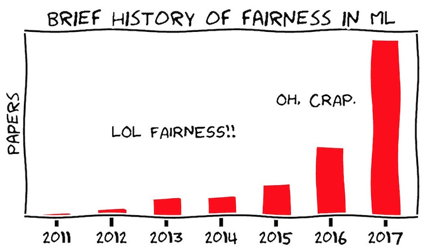
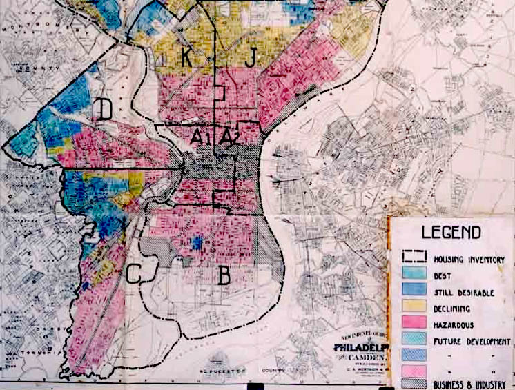
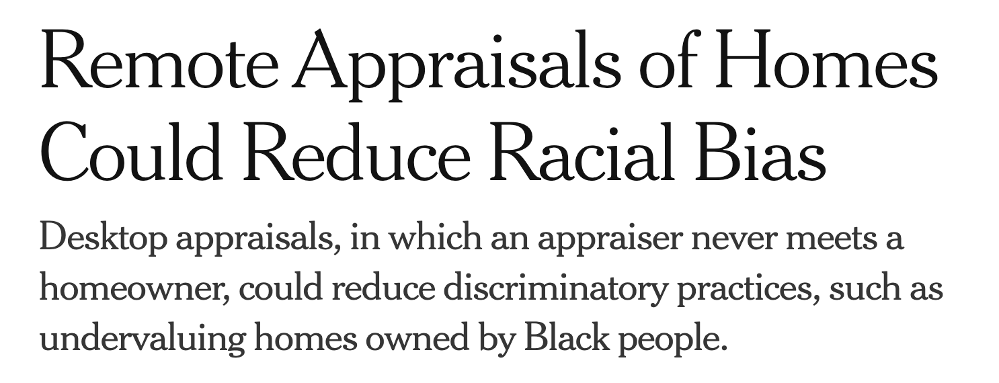
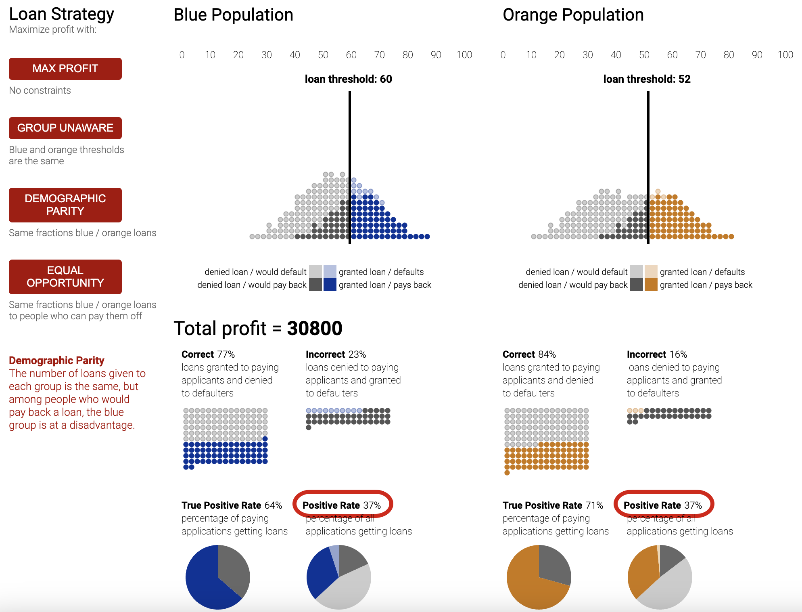
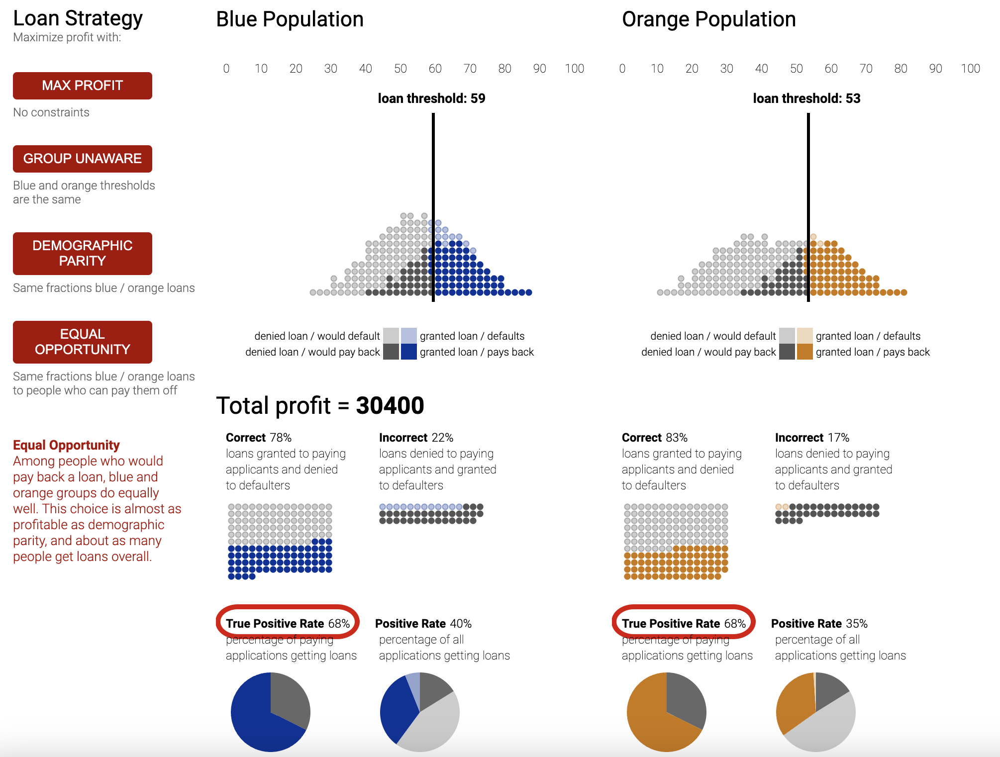

<!-- .element: class="titleslide"  data-background="../_chapterimg/16_fairness.jpg" -->

## Machine Learning in Production

# Measuring Fairness

---
## Diving into Fairness...

<!-- .element: class="plain stretch" -->

----
## Reading

Required:
- Nina Grgic-Hlaca, Elissa M. Redmiles, Krishna P. Gummadi, and Adrian Weller.
[Human Perceptions of Fairness in Algorithmic Decision Making:
A Case Study of Criminal Risk Prediction](https://dl.acm.org/doi/pdf/10.1145/3178876.3186138)
In WWW, 2018.

Recommended:
- Ian Foster, Rayid Ghani, Ron S. Jarmin, Frauke Kreuter and Julia Lane. [Big Data and Social Science: Data Science Methods and Tools for Research and Practice](https://textbook.coleridgeinitiative.org/). Chapter 11, 2nd ed, 2020
- Solon Barocas and Moritz Hardt and Arvind Narayanan. [Fairness and Machine Learning](http://www.fairmlbook.org). 2019 (incomplete book)
- Pessach, Dana, and Erez Shmueli. "[A Review on Fairness in Machine Learning](https://dl.acm.org/doi/full/10.1145/3494672)." ACM Computing Surveys (CSUR) 55, no. 3 (2022): 1-44.

---
# Learning Goals

* Understand different definitions of fairness
* Discuss methods for measuring fairness
* Outline interventions to improve fairness at the model level

---
# Fairness: Measurements

How do we measure fairness of an ML model?
 
----
### Fairness is still an actively studied & disputed concept!

<!-- references -->
Source: Mortiz Hardt, https://fairmlclass.github.io/

----
## Fairness: Measurements

* Anti-classification (fairness through blindness)
* Group fairness (independence)
* Equalized odds (separation)
* ...and numerous others and variations!

---
# Running Example: Mortgage Applications

* Large loans repaid over long periods
* Home ownership is key path to build generational wealth
* Past decisions often discriminatory (redlining)
* Replace biased human decisions by accurate ML model
  - income, other debt, home value
  - past debt and payment behavior (credit score)

----
## What is fair in mortgage applications?

<!-- discussion -->

----
## Recall: What is fair?

> Fairness discourse asks questions about how to treat people and whether treating different groups of people differently is ethical. If two groups of people are systematically treated differently, this is often considered unfair.

----
## Recall: What is fair?

<!-- .element: class="stretch" -->

----
## What is fair in mortgage applications?

1. Distribute loans equally across all groups of protected attribute(s)
   (e.g., ethnicity)
2. Prioritize those who are more likely to pay back (e.g., higher income, good credit history)
2. Prioritize those who are more in need

...

Note: slack vote

----
## How mortgage pisses people off: Redlining

<!-- colstart -->

<!-- .element: class="stretch" -->

<!-- col -->

Withold services (e.g., mortgage, education, retail) from people in neighborhoods
deemed "risky"

Map of Philadelphia, 1936,  Home Owners' Loan Corps. (HOLC)
* Classification based on  estimated "riskiness" of loans
<!-- colend -->

----
## How mortgage pisses people off: Past bias

<!-- references -->
Source: Federal Reserve’s [Survey of Consumer Finances](https://www.federalreserve.gov/econres/scfindex.htm)

Notes: 
much of fairness discourse here is trying to account for unequal starting positions

----
## Caveat on Intersectionality 

Individuals can and do fall into multiple groups!

Subgroup fairness gets _extremely_ technically complicated quickly.

We therefore focus on the simple cases for the purposes of the material in this class. 

---
# Fairness: Measurements

* *Anti-classification (fairness through blindness)*
* Group fairness (independence)
* Equalized odds (separation)
* ...and numerous others and variations!

----
## Anti-Classification

<!-- .element: class="stretch" -->

* Also called _fairness through blindness_ or _fairness through unawareness_
* Ignore certain sensitive attributes when making a decision
* Example: Remove gender and race from mortgage model

----
## Anti-Classification: Example

<!-- .element: class="stretch" -->

"After Ms. Horton removed all signs of Blackness, a second appraisal valued a Jacksonville home owned by her and her husband, Alex Horton, at 40 percent higher."

<!-- references_ -->
https://www.nytimes.com/2022/03/21/realestate/remote-home-appraisals-racial-bias.html

----
## Anti-Classification

<!-- .element: class="stretch" -->

*Easy to implement, but any limitations?*

----
## Recall: Proxies

*Features correlate with protected attributes*

----
## Also, recall: Not all discrimination is harmful

<!-- .element: class="stretch" -->

* Loan lending: Gender discrimination is illegal.
* Medical related: Gender-specificity may be desirable (women generally pay less for life insurance than men, since they tend to live longer.)

----
## Anti-Classification

<!-- .element: class="stretch" -->

* Ignore certain sensitive attributes when making a decision
* Advantage: Easy to implement and test
* Limitations
  * Sensitive attributes may be correlated with other features
  * Some ML tasks need sensitive attributes (e.g., medical diagnosis)

----
## Ensuring Anti-Classification

How to train models that are fair w.r.t. anti-classification?

<!-- discussion -->

----
## Ensuring Anti-Classification

How to train models that are fair w.r.t. anti-classification?

* Simply remove features for protected attributes from training and inference data

* Null/randomize protected attribute during inference

*(does not account for correlated attributes, is not required to)*

----
## Anti-Classification Example

<!-- .element: style="width: 800px" -->

----
## Testing Anti-Classification

How do we test that a classifier achieves anti-classification?

<!-- discussion -->

----
## Testing Anti-Classification

Straightforward invariant for classifier $f$ and protected attribute $p$: 

> $\forall x. f(x[p\leftarrow 0]) = f(x[p\leftarrow 1])$

*(does not account for correlated attributes, is not required to)*

* Test with *any* test data, e.g., purely random data or existing test data
* Any single inconsistency shows that the protected attribute was used. Can also report percentage of inconsistencies.

<!-- references -->
See for example: Galhotra, Sainyam, Yuriy Brun, and Alexandra Meliou. "[Fairness testing: testing software for discrimination](http://people.cs.umass.edu/brun/pubs/pubs/Galhotra17fse.pdf)." In Proceedings of the 2017 11th Joint Meeting on Foundations of Software Engineering, pp. 498-510. 2017.

----
## Breakout: Cancer Prognosis

In groups, post to `#lecture` tagging members:

Does the model meet anti-classification fairness w.r.t. gender?
> $\forall x. f(x[p\leftarrow 0]) = f(x[p\leftarrow 1])$

Write your calculation and reasoning!

Notes:
prob cancer male vs female

----
## Anti-Classification: Discussion

*Testing of anti-classification barely needed, because easy to ensure by constructing during training or inference!*

* Anti-classification is a good starting point to think about protected attributes
* Useful baseline for comparison
* Easy to implement, but only effective if (1) no proxies among features
and (2) protected attributes add no predictive power 

---
# Fairness: Measurements

* Anti-classification (fairness through blindness)
* *Group fairness (independence)*
* Equalized odds (separation)
* ...and numerous others and variations!

----
## Group fairness

Key idea: Outcomes matter, not accuracy!

Compare outcomes across two groups
* Similar rates of accepted loans across racial/gender groups?
* Similar chance of being hired/promoted between gender groups?
* Similar rates of (predicted) recidivism across racial groups?

----
## Disparate impact vs. disparate treatment

Disparate treatment: Practices or rules that treat a certain protected
group(s) differently from others
* e.g., Apply different mortgage rules for people from different backgrounds 

Disparate impact: Neutral rules, but outcome is worse for
 one or more protected groups
* Same rules are applied, but certain groups have a harder time
  obtaining mortgage in a particular neighborhood 

----
## Group fairness in discrimination law

Relates to *disparate impact* and the four-fifth rule

Can sue organizations for discrimination if they 
* mostly reject job applications from one minority group (identified by protected classes) and hire mostly from another
* reject most loans from one minority group and more frequently accept applicants from another

> Four-fifths rule: If the selection rate for a protected group is less than 80% of the selection rate for the group with the highest selection rate, there is adverse impact.

----
## Notation

* $X$: Feature set (e.g., age, race, education, region, income, etc.,)  
* $A \in X$: Sensitive attribute (e.g., gender)
* $R$: Regression score (e.g., predicted likelihood of on-time loan payment)
* $Y'$: Classifier output
  * $Y' = 1$ if and only if $R > T$ for some threshold $T$
  * e.g., Grant the loan ($Y' = 1$) if the likelihood of paying back > 80% 
* $Y$: Target variable being predicted ($Y = 1$ if the person actually
  pays back on time)

[Setting classification thresholds: Loan lending example](https://research.google.com/bigpicture/attacking-discrimination-in-ml)

----
## Group Fairness

> $P[Y' = 1 | A = a]  = P[Y' = 1 | A = b]$

* Also called _independence_ or _demographic parity_
* Mathematically, $Y' \perp A$
  * Prediction ($Y'$)  must be independent of the sensitive attribute ($A$)
* Examples:
	* The predicted rate of recidivism is the same across all races
	* Both women and men have the equal probability of being promoted
		* i.e., P[promote = 1 | gender = M] = P[promote = 1 | gender = F] 

Notes: probability is the same across all groups

----
## Group Fairness Limitations

What are limitations of group fairness?

<!-- discussion -->

----
## Group Fairness Limitations

* Ignores possible correlation between $Y$ and $A$
  * Rules out perfect predictor $Y' = Y$ when $Y$ & $A$ are correlated!
* Permits abuse and laziness: Can be satisfied by randomly assigning    a positive outcome ($Y' = 1$) to protected groups
	* e.g., Randomly promote people (regardless of their
      job performance) to match the rate across all groups

Notes: firing practices

----
## Adjusting Thresholds for Group Fairness

Select different classification thresholds ($t_0$, $t_1$) for different groups (A = 0,  A = 1) to achieve group fairness, such that 
> $P[R > t_0 | A = 0]  = P[R > t_1 | A = 1]$

> Example: Mortgage application
>  * R: Likelihood of paying back the loan on time
>  * Suppose: With a uniform threshold used (i.e., R = 80%), group fairness is not achieved
>	* P[R > 0.8 | A = 0] = 0.4,  P[R > 0.8 | A = 1] = 0.7
>  * Adjust thresholds to achieve group fairness
>	* P[R > 0.6 | A = 0]  = P[R > 0.8 | A = 1]

----
## Group Fairness Example

<!-- .element: style="width: 800px" -->

----
## Adjusting Thresholds for Group Fairness

> Mortgage application: P[R > 0.6 | A = 0]  = P[R > 0.8 | A = 1]

Wouldn't group A = 1 argue it's unfair? When does this type of adjustment make sense?

<!-- discussion -->

----
## Testing Group Fairness

*How would you test whether a classifier achieves group fairness?*

<!-- discussion -->

----
## Testing Group Fairness

Collect realistic, representative data (not randomly generated!)
* Use existing validation/test data
* Monitor production data
* (Somehow) generate realistic test data, e.g. from probability distribution of population

Separately measure the rate of positive predictions
* e.g., P[promoted = 1 | gender = M],      P[promoted = 1 | gender = F] = ?

Report issue if the rates differ beyond some threshold $\epsilon$ across
groups
  

----
## Breakout Cont': Cancer Prognosis

In groups, post to `#lecture` tagging members:

* ~Does the model meet anti-classification fairness w.r.t. gender?~
* Does the model meet group fairness?

> $P[Y' = 1 | A = a]  = P[Y' = 1 | A = b]$

---
# Equalized odds

* Anti-classification (fairness through blindness)
* Group fairness (independence)
* *Equalized odds (separation)*
* ...and numerous others and variations! 

----
## Equalized odds

Key idea: Focus on accuracy (not outcomes) across two groups

* Similar default rates on accepted loans across racial/gender groups?
* Similar rate of "bad hires" and "missed stars" between gender groups?
* Similar accuracy of predicted recidivism vs actual recidivism across racial groups?

Accuracy matters, not outcomes!

----
## Equalized odds in discrimination law

Relates to *disparate treatment*

Typically, lawsuits claim that protected attributes (e.g., race, gender) were used in decisions even though they were irrelevant
* e.g., fired over complaint because of being Latino, whereas other White employees were not fired with similar complaints

Must prove that the defendant had *intention* to discriminate
* Often difficult: Relying on shifting justifications, inconsistent application of rules, or explicit remarks overheard or documented

----
## Equalized odds

$P[Y'=1∣Y=0,A=a] = P[Y'=1∣Y=0,A=b]$
$P[Y'=0∣Y=1,A=a] = P[Y'=0∣Y=1,A=b]$

Statistical property of *separation*: $Y' \perp A | Y$
  * Prediction must be independent of the sensitive attribute
  _conditional_ on the target variable

----
## Review: Confusion Matrix

<!-- .element: class="stretch" -->

Can we explain separation in terms of model errors?
* $P[Y'=1∣Y=0,A=a] = P[Y'=1∣Y=0,A=b]$
* $P[Y'=0∣Y=1,A=a] = P[Y'=0∣Y=1,A=b]$

----
## Separation

$P[Y'=1∣Y=0,A=a] = P[Y'=1∣Y=0,A=b]$ (FPR parity)

$P[Y'=0∣Y=1,A=a] = P[Y'=0∣Y=1,A=b]$ (FNR parity)

* $Y' \perp A | Y$: Prediction must be independent of the sensitive attribute
    _conditional_ on the target variable
* i.e., All groups are susceptible to the same false positive/negative rates
* Example: Y': Promotion decision, A: Gender of applicant: Y: Actual job performance

----
## Equalized odds Example

<!-- .element: style="width: 800px" -->

----
## Testing Separation

Requires realistic representative test data (telemetry or representative test data, not random)

Separately measure false positive and false negative rates
  * e..g, for FNR, compare P[promoted = 0 | female, good employee] vs P[promoted = 0 | male, good employee]

*How is this different from testing group fairness?*

Notes: need labels
hard in some applications

----
## Breakout Cont': Cancer Prognosis

In groups, post to `#lecture` tagging members:

* ~Does the model meet anti-classification fairness w.r.t. gender?~
* ~Does the model meet group fairness?~
* Does the model meet equalized odds?
* Is the model fair enough to use?  

---
# Other fairness measures

* Anti-classification (fairness through blindness)
* Group fairness (independence)
* Equalized odds (separation)**
* **...and numerous others and variations!**

----

----
## Many measures

Many measures proposed

Some specialized for tasks (e.g., ranking, NLP)

Some consider downstream utility of various outcomes

Most are similar to the three discussed
* Comparing different measures in the error matrix (e.g., false positive rate, lift)

---
# Outlook: Building Fair ML-Based Products

**Next lecture:** Fairness is a *system-wide* concern

* Identifying and negotiating fairness requirements
* Fairness beyond model predictions (product design, mitigations, data collection)
* Fairness in process and teamwork, barriers and responsibilities
* Documenting fairness at the interface
* Monitoring
* Promoting best practices

---
# Summary

* Three definitions of fairness: Anti-classification, group fairness, equalized odds
* Tradeoffs between fairness criteria
  * What is the goal?
  * Key: how to deal with unequal starting positions
* Improving fairness of a model
  * In all *pipeline stages*: data collection, data cleaning, training, inference, evaluation

----
## Further Readings

- 🕮 Ian Foster, Rayid Ghani, Ron S. Jarmin, Frauke Kreuter and Julia Lane. [Big Data and Social Science: Data Science Methods and Tools for Research and Practice](https://textbook.coleridgeinitiative.org/). Chapter 11, 2nd ed, 2020
- 🕮 Solon Barocas and Moritz Hardt and Arvind Narayanan. [Fairness and Machine Learning](http://www.fairmlbook.org). 2019 (incomplete book)
- 🗎 Pessach, Dana, and Erez Shmueli. "[A Review on Fairness in Machine Learning](https://dl.acm.org/doi/full/10.1145/3494672)." ACM Computing Surveys (CSUR) 55, no. 3 (2022): 1-44.

<!-- 
----
## Practitioner Challenges

* Fairness is a system-level property
  - Consider goals, user interaction design, data collection, monitoring, model interaction (properties of a single model may not matter much)
* Fairness-aware data collection, fairness testing for training data
* Identifying blind spots
  - Proactive vs reactive
  - Team bias and (domain-specific) checklists
* Fairness auditing processes and tools
* Diagnosis and debugging (outlier or systemic problem? causes?)
* Guiding interventions (adjust goals? more data? side effects? chasing mistakes? redesign?)
* Assessing human bias of humans in the loop

Holstein, Kenneth, Jennifer Wortman Vaughan, Hal Daumé III, Miro Dudik, and Hanna Wallach. "[Improving fairness in machine learning systems: What do industry practitioners need?](http://users.umiacs.umd.edu/~hal/docs/daume19fairness.pdf)" In Proceedings of the 2019 CHI Conference on Human Factors in Computing Systems, pp. 1-16. 2019.

 -->
