<!-- .element: class="titleslide"  data-background="../_chapterimg/18_explainability.jpg" -->
<div class="stretch"></div>

## Machine Learning in Production


# Explainability and Interpretability


---
## Explainability as Building Block in Responsible Engineering


<!-- .element: class="plain stretch" -->


----
## "Readings"

Required one of:
* 🎧 Data Skeptic Podcast Episode “[Black Boxes are not Required](https://dataskeptic.com/blog/episodes/2020/black-boxes-are-not-required)” with Cynthia Rudin (32min) 
* 🗎 Rudin, Cynthia. "[Stop explaining black box machine learning models for high stakes decisions and use interpretable models instead](https://arxiv.org/abs/1811.10154)." Nature Machine Intelligence 1, no. 5 (2019): 206-215.  

Recommended supplementary reading: 
* 🕮 Christoph Molnar. "[Interpretable Machine Learning: A Guide for Making Black Box Models Explainable](https://christophm.github.io/interpretable-ml-book/)." 2019

----
# Learning Goals

* Understand the importance of and use cases for interpretability
* Explain the tradeoffs between inherently interpretable models and post-hoc explanations
* Measure interpretability of a model
* Select and apply techniques to debug/provide explanations for data, models and model predictions
* Eventuate when to use interpretable models rather than ex-post explanations

---
# Motivating Examples


----


<!-- .element: class="stretch" -->


----

<!-- .element style="width:850px" -->

<!-- references -->

Image: Gong, Yuan, and Christian Poellabauer. "[An overview of vulnerabilities of voice controlled systems](https://arxiv.org/pdf/1803.09156.pdf)." arXiv preprint arXiv:1803.09156 (2018).


----
## Is this recidivism model fair?

```fortran
IF age between 18–20 and sex is male THEN 
  predict arrest
ELSE IF age between 21–23 and 2–3 prior offenses THEN 
  predict arrest
ELSE IF more than three priors THEN 
  predict arrest
ELSE 
  predict no arrest
```

<!-- references -->

Rudin, Cynthia. "[Stop explaining black box machine learning models for high stakes decisions and use interpretable models instead](https://arxiv.org/abs/1811.10154)." Nature Machine Intelligence 1, no. 5 (2019): 206-215.  


----
## How to consider seriousness of the crime?


<!-- .element: class="stretch" -->

<!-- references_ -->
Rudin, Cynthia, and Berk Ustun. "[Optimized scoring systems: Toward trust in machine learning for healthcare and criminal justice](https://users.cs.duke.edu/~cynthia/docs/WagnerPrizeCurrent.pdf)." Interfaces 48, no. 5 (2018): 449-466.


----
## Is there an actual problem? How to find out?

<div class="tweet" data-src="https://twitter.com/dhh/status/1192540900393705474"></div>

----

<!-- .element: class="stretch" -->

----
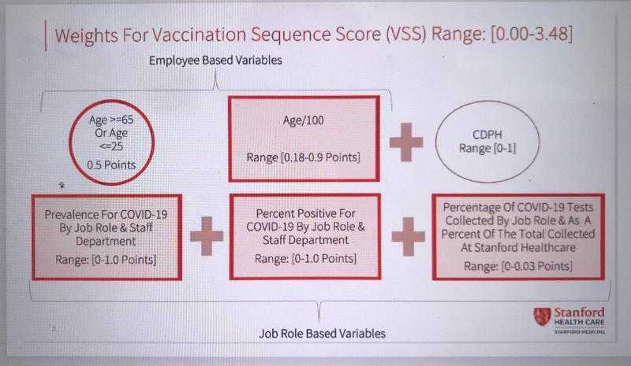<!-- .element style="width:1100px" -->

----
## Explaining Decisions

Cat? Dog? Lion? -- Confidence? Why?


----
## What's happening here?


<!-- .element: class="stretch" -->


----
## Explaining Decisions

[](slacknotifications.jpg)
<!-- .element: class="stretch" -->

----
## Explainability in ML

Explain how the model made a decision
  - Rules, cutoffs, reasoning?
  - What are the relevant factors? 
  - Why those rules/cutoffs?

Challenging because models too complex and based on data
  - Can we understand the rules?
  - Can we understand why these rules?


---
# Why Explainability?

<!-- discussion -->

----
## Debugging

<!-- colstart -->

* Why did the system make a wrong prediction in this case?
* What does it actually learn?
* What data makes it better?
* How reliable/robust is it?
* How much does second model rely on outputs of first?
* Understanding edge cases

<!-- col -->


<!-- colend -->

**Debugging is the most common use in practice** (Bhatt et al. "Explainable machine learning in deployment." In Proc. FAccT. 2020.)


----
## Auditing

* Understand safety implications 
* Ensure predictions use objective criteria and reasonable rules
* Inspect fairness properties
* Reason about biases and feedback loops
* Validate "learned specifications/requirements" with stakeholders

```fortran
IF age between 18–20 and sex is male THEN predict arrest
ELSE IF age between 21–23 and 2–3 prior offenses THEN predict arrest
ELSE IF more than three priors THEN predict arrest
ELSE predict no arrest
```

----
## Trust

<!-- colstart -->

More accepting a prediction if clear how it is made, e.g.,
  * Model reasoning matches intuition; reasoning meets fairness criteria
  * Features are difficult to manipulate
  * Confidence that the model generalizes beyond target distribution

<!-- col -->

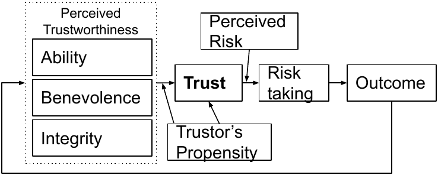
<!-- .element: class="plain" -->

<!-- references -->

Conceptual model of trust: R. C. Mayer, J. H. Davis, and F. D. Schoorman. An integrative model of organizational trust. Academy
of Management Review, 20(3):709–734, July 1995.

<!-- colend -->

----
## Actionable Insights to Improve Outcomes

> "What can I do to get the loan?"

> "How can I change my message to get more attention on Twitter?"

> "Why is my message considered as spam?"

----
## Regulation / Legal Requirements


> The EU General Data Protection Regulation extends the automated decision-making rights [...] to provide a legally disputed form of a **right to an explanation**: "[the data subject should have] the right ... to obtain an explanation of the decision reached"


 
> US Equal Credit Opportunity Act requires to notify applicants of action taken with specific reasons: "The statement of reasons for adverse action required by paragraph (a)(2)(i) of this section must be specific and indicate the principal reason(s) for the adverse action."

<!-- references -->

See also https://en.wikipedia.org/wiki/Right_to_explanation

----
## Curiosity, learning, discovery, science


<!-- .element: class="stretch" -->

----
## Curiosity, learning, discovery, science


<!-- .element: class="stretch" -->


----
## Settings where Interpretability is *not* Important?

<!-- discussion -->

Notes:
* Model has no significant impact (e.g., exploration, hobby)
* Problem is well studied? e.g optical character recognition
* Security by obscurity? -- avoid gaming


----
## Exercise: Debugging a Model

Consider the following debugging challenges. In groups discuss how you would debug the problem. In 3 min report back to the class.

<!-- colstart -->
*Algorithm bad at recognizing some signs in some conditions:*

<!-- col -->
*Graduate appl. system seems to rank applicants from HBCUs low:*

<!-- colend -->

<!-- smallish -->
<!-- references -->
Left Image: CC BY-SA 4.0, Adrian Rosebrock 


---
# Defining Interpretability

<!-- references -->
Christoph Molnar. "[Interpretable Machine Learning: A Guide for Making Black Box Models Explainable](https://christophm.github.io/interpretable-ml-book/)." 2019
----
## Interpretability Definitions 

Two common approaches:

> Interpretability is the degree to which a human can understand the cause of a decision

> Interpretability is the degree to which a human can consistently predict the model’s result.

(No mathematical definition)


**How would you measure interpretability?**
----
## Explanation

Understanding a single prediction for a given input

> Your loan application has been *declined*. If your *savings account* had had more than $100 your loan application would be *accepted*.

Answer **why** questions based on human psychology, such as 
  * Why was the image classified as a cat but not a tiger? (justification, contrastive)
  * If I had a higher income, would I get the loan? (justification, counterfactual)
  * Why did the treatment not work for the patient? (debugging)
  * Why is turnover higher among women? (general science question)

**How would you measure explanation quality?**

----
## Intrinsic interpretability vs Post-hoc explanation?

<!-- colstart -->
Models simple enough to understand 
(e.g., short decision trees, sparse linear models)


<!-- col -->
Explanation of opaque model, local or global

> Your loan application has been *declined*. If your *savings account* had more than $100 your loan application would be *accepted*.

<!-- colend -->


----
## On Terminology

Rudin's terminology and this lecture:
  - Interpretable models: Intrinsily interpretable models
  - Explainability: Post-hoc explanations


And in general:
* Interpretability: property of a model
* Explainability: ability to explain the workings/predictions of a model
* Explanation: justification of a single prediction
* Transparency: The user is aware that a model is used / how it works

*These terms are often used inconsistently or interchangeble*


<!-- .element: class="cornerimg" -->


---
# Understanding a Model

Levels of explanations:

* **Understanding a model**
* Explaining a prediction
* Understanding the data

----
## Inherently Interpretable: Sparse Linear Models

$f(x) = \alpha + \beta_1 x_1 + ... + \beta_n x_n$


* Truthful explanations, easy to understand for humans
* Easy to derive contrastive explanation and feature importance
* Requires feature selection/regularization to minimize to few important features (e.g. Lasso); possibly restricting possible parameter values

----
## Score card: Sparse linear model with "round" coefficients


<!-- .element: class="stretch" -->
 
----
## Inherently Interpretable: Shallow Decision Trees

* Easy to interpret up to a size
* Possible to derive counterfactuals and feature importance
* Unstable with small changes to training data


```fortran
IF age between 18–20 and sex is male THEN predict arrest
ELSE IF age between 21–23 and 2–3 prior offenses THEN predict arrest
ELSE IF more than three priors THEN predict arrest
ELSE predict no arrest
```


----
## Inherently Interpretable: Decision Rules

*if-then rules mined from data*

easy to interpret if few and simple rules


see [association rule mining](https://en.wikipedia.org/wiki/Association_rule_mining):
```text
{Diaper, Beer} -> Milk  (40% support, 66% confidence)
Milk -> {Diaper, Beer}  (40% support, 50% confidence)
{Diaper, Beer} -> Bread (40% support, 66% confidence)
```

----
## Not all Linear Models and Decision Trees are Inherently Interpretable

* Models can be very big, many parameters (factors, decisions)
* Nonlinear interactions possibly hard to grasp
* Tool support can help (views)
* Random forests, ensembles no longer easily interpretable

<div class="smallish">

```
173554.681081086 * root + 318523.818532818 * heuristicUnit + -103411.870761673 * eq + -24600.5000000002 * heuristicVsids +
-11816.7857142856 * heuristicVmtf + -33557.8961038976 * heuristic + -95375.3513513509 * heuristicUnit * satPreproYes + 
3990.79729729646 * transExt * satPreproYes + -136928.416666666 * eq * heuristicUnit + 12309.4990990994 * eq * satPreproYes + 
33925.0833333346 * eq * heuristic + -643.428571428088 * backprop * heuristicVsids + -11876.2857142853 * backprop * 
heuristicUnit + 1620.24242424222 * eq * backprop + -7205.2500000002 * eq * heuristicBerkmin + -2 * Num1 * Num2 + 10 * Num3 * Num4
```

</div>

Notes: Example of a performance influence model from http://www.fosd.de/SPLConqueror/ -- not the worst in terms of interpretability, but certainly not small or well formated or easy to approach.


----
## Research in Inherently Interpretable Models

Several approaches to learn sparse constrained models (e.g., fit score cards, simple if-then-else rules)

Often heavy emphasis on feature engineering and domain-specificity

Possibly computationally expensive

<!-- references -->

Rudin, Cynthia. "[Stop explaining black box machine learning models for high stakes decisions and use interpretable models instead](https://arxiv.org/abs/1811.10154)." Nature Machine Intelligence 1, no. 5 (2019): 206-215.  


----
## Post-Hoc Model Explanation: Global Surrogates

1. Select dataset X (previous training set or new dataset from same distribution)
2. Collect model predictions for every value: $y_i=f(x_i)$
3. Train *inherently interpretable* model $g$ on (X,Y)
4. Interpret surrogate model $g$


Can measure how well $g$ fits $f$ with common model quality measures, typically $R^2$

**Advantages? Disadvantages?**

Notes:
Flexible, intuitive, easy approach, easy to compare quality of surrogate model with validation data ($R^2$).
But: Insights not based on real model; unclear how well a good surrogate model needs to fit the original model; surrogate may not be equally good for all subsets of the data; illusion of interpretability.
Why not use surrogate model to begin with?


----
## Advantages and Disadvantages of Surrogates?

<!-- discussion -->


----
## Advantages and Disadvantages of Surrogates?


* short, contrastive explanations possible
* useful for debugging
* easy to use; works on lots of different problems
* explanations may use different features than original model
*
* explanation not necessarily truthful
* explanations may be unstable
* likely not sufficient for compliance scenario

----
## Post-Hoc Model Explanation #1: Feature Importance


<!-- .element: class="stretch" -->

----
## Feature Importance

<div class="smallish">

* Permute a feature's values in validation data -> hide it for prediction
* Measure influence on accuracy
* -> This evaluates feature's influence without retraining the model
*
* Highly compressed, *global* insights
* Effect for feature + interactions
* Can only be computed on labeled data, depends on model accuracy, randomness from permutation
* May produce unrealistic inputs when correlations exist

(Can be evaluated both on training and validation data)

</div>

Note: Training vs validation is not an obvious answer and both cases can be made, see Molnar's book. Feature importance on the training data indicates which features the model has learned to use for predictions.


----
## Post-Hoc Model Explanation #2: Partial Dependence Plot (PDP)


<!-- .element: class="stretch" -->


----
## Partial Dependence Plot

* Computes marginal effect of feature on predicted outcome
* Identifies relationship between feature and outcome (linear, monotonous, complex, ...)
*
* Intuitive, easy interpretation
* Assumes no correlation among features


----
## Partial Dependence Plot for Interactions


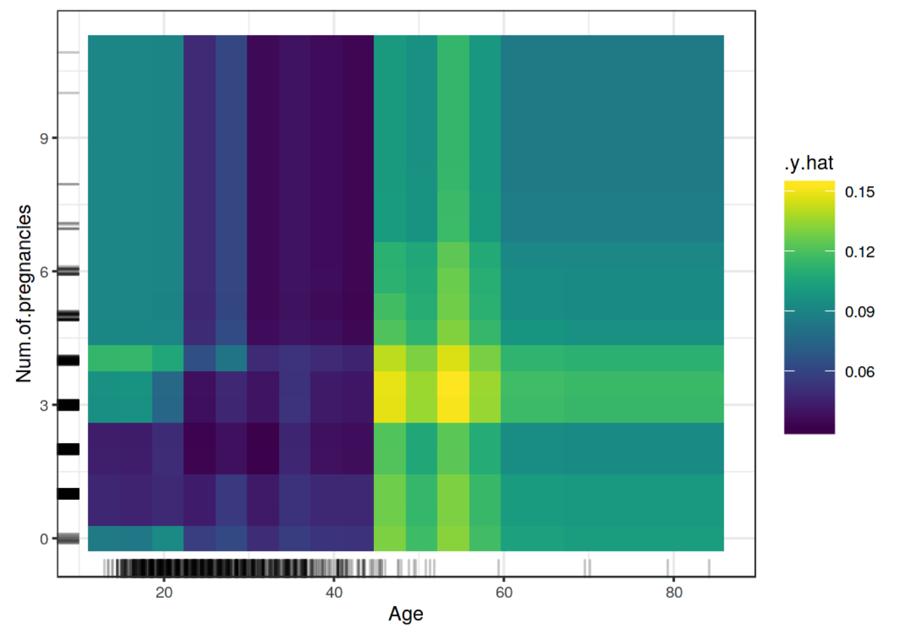
<!-- .element: class="stretch" -->

<!-- references_ -->
Probability of cancer; source: 
Christoph Molnar. "[Interpretable Machine Learning](https://christophm.github.io/interpretable-ml-book/)." 2019


----
## Post-Hoc Model Explanation #3: Concept Bottleneck Models

<!-- colstart -->

<div class="smallish">

Hybrid/partially interpretable model

Force models to learn features, not final predictions. Use inherently interpretable model on those features

Requries to label features in training data

</div>

<!-- col -->


<!-- colend -->

<!-- references -->

Koh, Pang Wei, Thao Nguyen, Yew Siang Tang, Stephen Mussmann, Emma Pierson, Been Kim, and Percy Liang. "[Concept bottleneck models](http://proceedings.mlr.press/v119/koh20a/koh20a.pdf)." In Proc. ICML, 2020.

----
## Summary: Understanding a Model

Understanding of the whole model, not individual predictions!

Some models inherently interpretable:
* Sparse linear models
* Shallow decision trees

Ex-post explanations for opaque models:
* Global surrogate models
* Feature importance, partial dependence plots
* Many more in the literature


---
# Explaining a Prediction


Levels of explanations:

* Understanding a model
* **Explaining a prediction**
* Understanding the data


----
## Understanding Predictions from Inherently Interpretable Models is easy

* Derive key influence factors or decisions from model parameters
* Derive contrastive counterfacturals from models

**Examples:** Predict arrest for 18 year old male with 1 prior:

```fortran
IF age between 18–20 and sex is male THEN predict arrest
ELSE IF age between 21–23 and 2–3 prior offenses THEN predict arrest
ELSE IF more than three priors THEN predict arrest
ELSE predict no arrest
```


----
## Posthoc Prediction Explanation #1: Feature Influences

*Which features were most influential for a specific prediction?*


<!-- .element: class="stretch" -->


<!-- references_ -->
Source: https://github.com/marcotcr/lime 

----
## Feature Influences in Images


<!-- .element: class="stretch" -->

<!-- references_ -->
Source: https://github.com/marcotcr/lime 

----
## Feature Importance vs Feature Influence

<!-- colstart -->

Feature importance is global for the entire model (all predictions)


<!-- col -->

Feature influence is for a single prediction


<!-- colend -->

----
## Feature Infl. with Local Surrogates (LIME)

<!-- colstart -->

<div class="smallish">

*Create an inherently interpretable model (e.g. sparse linear model) for the area around a prediction*

> “An explanation is a local linear approximation of the model's behaviour. While the model may be very complex globally, it is easier to approximate it around the vicinity of a particular instance. “

</div>

<!-- col -->


<!-- .element: style="width: 500px" class="plain" -->

<!-- colend -->


<!-- references -->
Ribeiro, Marco Tulio, Sameer Singh, and Carlos Guestrin. "["Why should I trust you?" Explaining the predictions of any classifier](http://dust.ess.uci.edu/ppr/ppr_RSG16.pdf)." In Proc International Conference on Knowledge Discovery and Data Mining, pp. 1135-1144. 2016.


----
## Feature Infl. with Local Surrogates (LIME)

<!-- colstart -->


For *each input data point*...
* Look at model’s predictions for a bunch of nearby inputs.
* Closer points are more important than further points.
* Fit a linear model. Its weights are the feature importances.

<!-- col -->


<!-- .element: style="width: 500px" class="plain" -->

<!-- colend -->


<!-- references -->
Ribeiro, Marco Tulio, Sameer Singh, and Carlos Guestrin. "["Why should I trust you?" Explaining the predictions of any classifier](http://dust.ess.uci.edu/ppr/ppr_RSG16.pdf)." In Proc International Conference on Knowledge Discovery and Data Mining, pp. 1135-1144. 2016.


----
## LIME Example

<!-- .element: class="stretch" -->

<!-- references_ -->
Source: Ribeiro, Marco Tulio, Sameer Singh, and Carlos Guestrin. "["Why should I trust you?" Explaining the predictions of any classifier](http://dust.ess.uci.edu/ppr/ppr_RSG16.pdf)." In Proc. KDD. 2016.


----
## LIME Example

<!-- .element: class="stretch" -->

<!-- references_ -->
Source: Ribeiro, Marco Tulio, Sameer Singh, and Carlos Guestrin. "["Why should I trust you?" Explaining the predictions of any classifier](http://dust.ess.uci.edu/ppr/ppr_RSG16.pdf)." In Proc. KDD. 2016.

----
## LIME Example

<!-- .element: class="stretch" -->

<!-- references_ -->
Source: Ribeiro, Marco Tulio, Sameer Singh, and Carlos Guestrin. "["Why should I trust you?" Explaining the predictions of any classifier](http://dust.ess.uci.edu/ppr/ppr_RSG16.pdf)." In Proc. KDD. 2016.

----
## Advantages and Disadvantages of Local Surrogates?

<!-- discussion -->


----
## Discussion on of Local Surrogates?

<!-- colstart -->

<div class="smallish">

* Quite easy to build!
* Proven useful for debugging
* 
* Unstable, it's training a small model based on points you select
* Too localized and you lose non-linear combinations
* Usually visualized via feature importance & the same heatmap might link to many different underlying explanation mechanisms so could end up being confusing

</div>

<!-- col -->

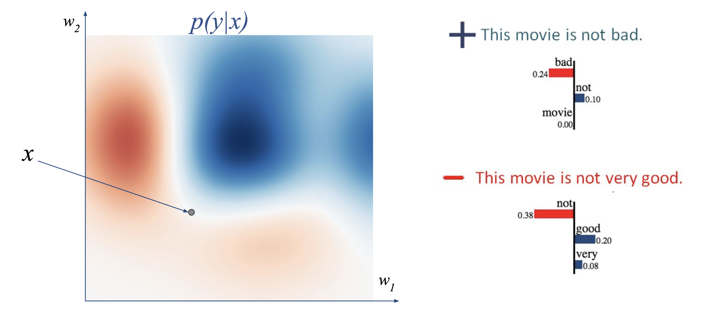

<!-- colend -->

----
## Feature Influence w/ Shapley Values / SHAP

<div class="smallish">

* Game-theoretic foundation for local explanations (1953)
* Explains contribution of feature, over predictions with different feature subsets
  - *"The Shapley value is the average marginal contribution of a feature value across all possible coalitions"*
* Solid theory ensures fair mapping of influence to features
* Requires heavy computation, usually only approximations feasible
* Explanations contain all features (ie. not sparse)
**Currently, most common local method used in practice**


</div>


<!-- references -->

Lundberg, Scott M., and Su-In Lee. "[A unified approach to interpreting model predictions](https://proceedings.neurips.cc/paper/2017/file/8a20a8621978632d76c43dfd28b67767-Paper.pdf)." In Advances in neural information processing systems, pp. 4765-4774. 2017.


----
## SHAP Force Plot


<!-- .element: class=" plain" style="width: 1200px"  -->
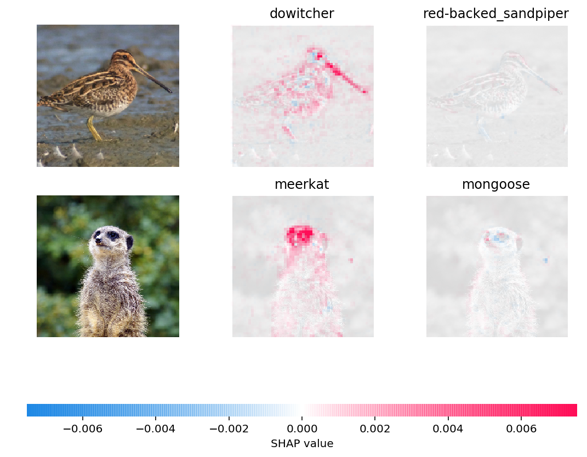
<!-- .element: class=" plain" style="width: 1200px" -->


----
## Posthoc Prediction Explanation #2: Anchors


<!-- .element: class="stretch plain" -->


----
## Posthoc Prediction Explanation #3: Counterfactual Explanations

*if X had not occured, Y would not have happened*

> Your loan application has been *declined*. If your *savings account* had had more than $100 your loan application would be *accepted*.


-> Smallest change to feature values that result in given output


----
## Multiple Counterfactuals

<div class="smallish">

<!-- colstart -->

Often long or multiple explanations

> Your loan application has been *declined*. If your *savings account* ...

> Your loan application has been *declined*. If your lived in ...

Report all or select "best" (e.g. shortest, most actionable, likely values)

<!-- col -->
*(Rashomon effect)*


<!-- colend -->

</div>

----


<!-- .element: class="stretch plain" -->

----
## Searching for Counterfactuals?

<!-- discussion -->

----
## Searching for Counterfactuals

Random search (with growing distance) possible, but inefficient

Many search heuristics, e.g. hill climbing or Nelder–Mead, may use gradient of model if available

Can incorporate distance in loss function

$$L(x,x^\prime,y^\prime,\lambda)=\lambda\cdot(\hat{f}(x^\prime)-y^\prime)^2+d(x,x^\prime)$$


(similar to finding adversarial examples)


----
<!-- .element style="width:1000px" -->


----
## Discussion: Counterfactuals

* Easy interpretation, can report both alternative instance or required change
* No access to model or data required, easy to implement
*
* Often many possible explanations (Rashomon effect), requires selection/ranking
* May require changes to many features, not all feasible
* May not find counterfactual within given distance
* Large search spaces, especially with high-cardinality categorical features

----
## Actionable Counterfactuals

*Example: Denied loan application*

* Customer wants feedback of how to get the loan approved
* Some suggestions are more actionable than others, e.g.,
  * Easier to change income than gender
  * Cannot change past, but can wait
* In distance function, not all features may be weighted equally

----
## Posthoc Prediction Explanation #4: Similarity

<!-- colstart -->

* k-Nearest Neighbors inherently interpretable (assuming intutive distance function)
* Attempts to build inherently interpretable image classification models based on similarity of fragments

<!-- col -->

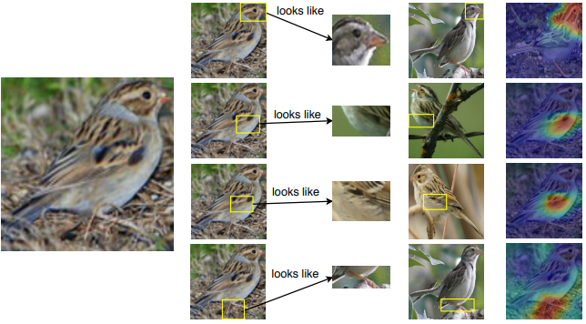
<!-- .element: class="stretch" -->

<!-- colend -->

<!-- references_ -->
Chen, Chaofan, Oscar Li, Daniel Tao, Alina Barnett, Cynthia Rudin, and Jonathan K. Su. "This looks like that: deep learning for interpretable image recognition." In NeurIPS (2019).


----
## Summary: Understanding a Prediction

Understanding a single predictions, not the model as a whole

Explaining influences, providing counterfactuals and sufficient conditions, showing similar instances

Easy on inherently interpretable models

Ex-post explanations for opaque models:
* Feature influences (LIME, SHAP, attention maps)
* Searching for Cunterfactuals
* Similarity, knn


---
# Understanding the Data


Levels of explanations:

* Understanding a model
* Explaining a prediction
* **Understanding the data**


----
## Data Explanation #1: Prototypes and Criticisms

* *Prototype* is a data instance that is representative of all the data
* *Criticism* is a data instance  not well represented by the prototypes


<!-- .element: class="stretch" -->

<!-- references_ -->
Source: 
Christoph Molnar. "[Interpretable Machine Learning](https://christophm.github.io/interpretable-ml-book/)." 2019

----
## Example: Prototypes and Criticisms?

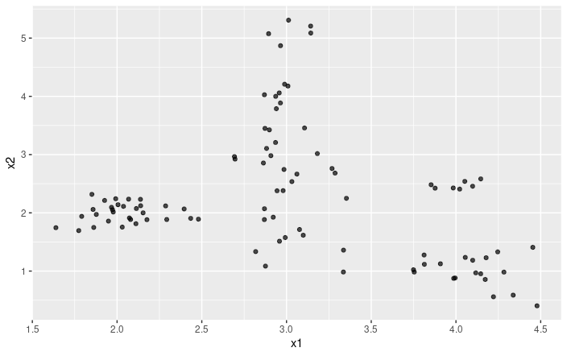
<!-- .element: class="stretch" -->


<!-- references_ -->
Source: 
Christoph Molnar. "[Interpretable Machine Learning](https://christophm.github.io/interpretable-ml-book/)." 2019

----
## Example: Prototypes and Criticisms


<!-- .element: class="stretch" -->

<!-- references_ -->
Source: 
Christoph Molnar. "[Interpretable Machine Learning](https://christophm.github.io/interpretable-ml-book/)." 2019

----
## Example: Prototypes and Criticisms

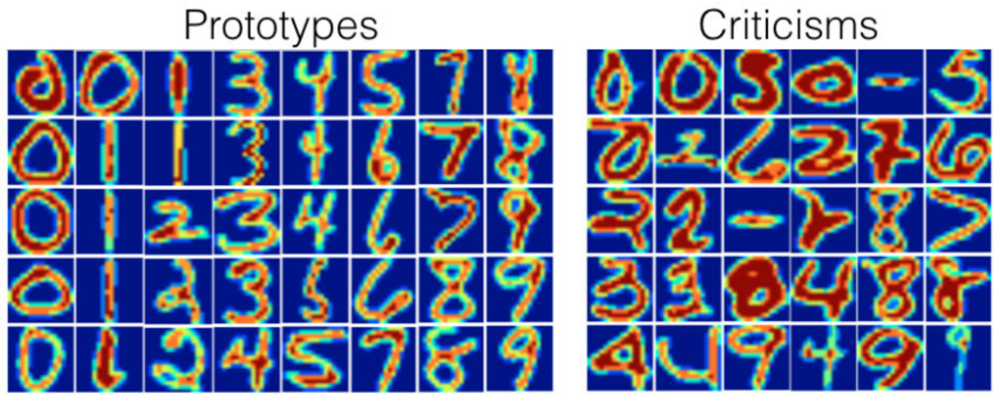
<!-- .element: class="stretch" -->

<!-- references_ -->
Source: 
Christoph Molnar. "[Interpretable Machine Learning](https://christophm.github.io/interpretable-ml-book/)." 2019

Note: The number of digits is different in each set since the search was conducted globally, not per group.


----
## Methods: Prototypes and Criticisms

Clustering of data (ala k-means)
  * k-medoids returns actual instances as centers for each cluster
  * MMD-critic identifies both prototypes and criticisms
  * see book for details

Identify globally or per class

----
## Discussion: Prototypes and Criticisms

* Easy to inspect data, useful for debugging outliers
* Generalizes to different kinds of data and problems
* Easy to implement algorithm
* 
* Need to choose number of prototypes and criticism upfront
* Uses all features, not just features important for prediction


----
## Data Explanation #2: Influential Instance

**Data debugging:** *What data most influenced the training?*


<!-- .element: class="stretch" -->

<!-- references_ -->
Source: 
Christoph Molnar. "[Interpretable Machine Learning](https://christophm.github.io/interpretable-ml-book/)." 2019

----
## Influential Instances

**Data debugging:** *What data most influenced the training? Is the model skewed by few outliers?*

Approach:
* Given training data with $n$ instances...
* ... train model $f$ with all $n$ instances
* ... train model $g$ with $n-1$ instances
* If $f$ and $g$ differ significantly, omitted instance was influential
  - Difference can be measured e.g. in accuracy or difference in parameters

Note: Instead of understanding a single model, comparing multiple models trained on different data


----
## Influential Instances Discussion

* Retraining for every data point is simple but expensive
* For some class of models, influence of data points can be computed without retraining (e.g., logistic regression), see book for details
* Hard to generalize to taking out multiple instances together (need to take out groups of data together)
* Useful model-agnostic debugging tool for models and data


<!-- references -->
Christoph Molnar. "[Interpretable Machine Learning: A Guide for Making Black Box Models Explainable](https://christophm.github.io/interpretable-ml-book/)." 2019

----
## Three Concepts

**Feature importance:** How much does the model rely on a feature, across all predictions?

**Feature influence:** How much does a specific prediction rely on a feature?

**Influential instance:** How much does the model rely on a single training data instance?

----
## Summary: Understanding the Data

Understand the characteristics of the data used to train the model

Many data exploration and data debugging techniques:
* Criticisms and prototypes
* Influential instances
* many others...


---
## Breakout: Debugging with Explanations

<div class="smallish">

In groups, discuss which explainability approaches may help and why. Tagging group members, write to `#lecture`.

<!-- colstart -->
*Algorithm bad at recognizing some signs in some conditions:*

<!-- col -->
*Graduate appl. system seems to rank applicants from HBCUs low:*

<!-- colend -->

</div>

<!-- references -->
Left Image: CC BY-SA 4.0, Adrian Rosebrock 


---
# Bonus: Explanations for Generative Models

----
## Attribution reuses existing methods

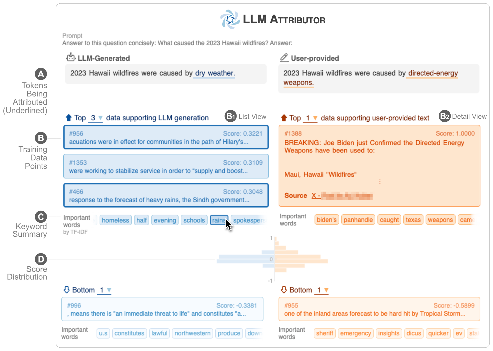
<!-- .element: class="stretch plain" -->

<!-- references_ -->
[LLM Attributor: Attribute LLM's Generated Text to Training Data](https://github.com/poloclub/LLM-Attributor)

----
## We can do Natural Language Explanation


<!-- references_ -->
Zellers, Rowan, et al. "From recognition to cognition: Visual commonsense reasoning." CVPR 2019

----
## Prompt vs. Explanation


<!-- .element: class="stretch plain" -->


----
## Prompt vs. Explanation

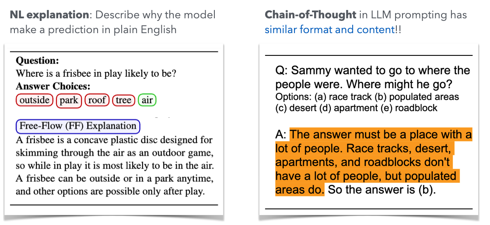
<!-- .element: class="stretch plain" -->

---
# "Stop explaining black box machine learning models for high stakes decisions and use interpretable models instead."


----
## Accuracy vs Explainability Conflict?

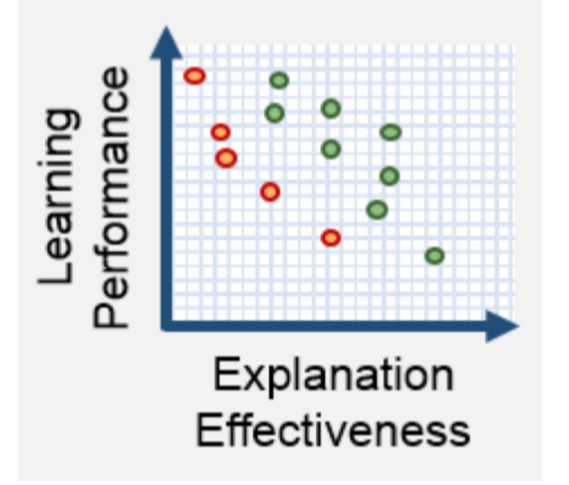
<!-- .element: class="stretch" -->

<!-- references_ -->
Graphic from the DARPA XAI BAA (Explainable Artificial Intelligence) 

----
## Faithfulness of Ex-Post Explanations

<!-- discussion -->

----
## CORELS’ model for recidivism risk prediction

```fortran
IF age between 18–20 and sex is male THEN predict arrest
ELSE IF age between 21–23 and 2–3 prior offenses THEN predict arrest
ELSE IF more than three priors THEN predict arrest
ELSE predict no arrest
```

Simple, interpretable model with comparable accuracy to proprietary COMPAS model

<!-- references -->

Rudin, Cynthia. "Stop explaining black box machine learning models for high stakes decisions and use interpretable models instead." Nature Machine Intelligence 1.5 (2019): 206-215. ([Preprint](https://arxiv.org/abs/1811.10154))


----
## "Stop explaining ..."

<div class="smallish">

Hypotheses:
* It is a myth that there is necessarily a trade-off between accuracy and interpretability (when having meaningful features)
* Explainable ML methods provide explanations that are not faithful to what the original model computes
* Explanations often do not make sense, or do not provide enough detail to understand what the black box is doing
* Black box models are often not compatible with situations where information outside the database needs to be combined with a risk assessment
* Black box models with explanations can lead to an overly complicated decision pathway that is ripe for human error

</div>

<!-- references -->

Rudin, Cynthia. "Stop explaining black box machine learning models for high stakes decisions and use interpretable models instead." Nature Machine Intelligence 1.5 (2019): 206-215. ([Preprint](https://arxiv.org/abs/1811.10154))

----
## Prefer Interpretable Models over Post-Hoc Explanations


* Interpretable models provide faithful explanations
  * post-hoc explanations may provide limited insights or illusion of understanding
  * interpretable models  can be audited
* Inherently interpretable models in many cases have similar accuracy
* Larger focus on feature engineering, more effort, but insights into when and *why* the model works
* Less research on interpretable models and some methods computationally expensive

----
## ProPublica Controversy


<!-- .element: class="stretch" -->

Notes: "ProPublica’s linear model was not truly an
“explanation” for COMPAS, and they should not have concluded that their explanation model uses the same
important features as the black box it was approximating."
----
## ProPublica Controversy


```fortran
IF age between 18–20 and sex is male THEN 
  predict arrest
ELSE IF age between 21–23 and 2–3 prior offenses THEN 
  predict arrest
ELSE IF more than three priors THEN 
  predict arrest
ELSE 
  predict no arrest
```

<!-- references -->

Rudin, Cynthia. "[Stop explaining black box machine learning models for high stakes decisions and use interpretable models instead](https://arxiv.org/abs/1811.10154)." Nature Machine Intelligence 1, no. 5 (2019): 206-215.  


----
## Drawbacks of Interpretable Models

Intellectual property protection harder
  - may need to sell model, not license as service
  - who owns the models and who is responsible for their mistakes?

Gaming possible; "security by obscurity" not a defense

Expensive to build (feature engineering effort, debugging, computational costs)

Limited to fewer factors, may discover fewer patterns, lower accuracy


---
# Summary

<div class="smallish">

* Interpretability useful for many scenarios: user feedback, debugging, fairness audits, science, ...
* Defining and measuring interpretability
  * Explaining the model
  * Explaining predictions
  * Understanding the data
* Inherently interpretable models: sparse regressions, shallow decision trees
* Providing ex-post explanations of opaque models: global and local surrogates, dependence plots and feature importance, anchors, counterfactual explanations, criticisms, and influential instances
* Consider implications on user interface design
* Gaming and manipulation with explanations

</div>

----
## Further Readings

<div class="small">


* Christoph Molnar. “[Interpretable Machine Learning: A Guide for Making Black Box Models Explainable](https://christophm.github.io/interpretable-ml-book/).” 2019
* Google PAIR. [People + AI Guidebook](https://pair.withgoogle.com/guidebook/). 2019.
* Cai, Carrie J., Samantha Winter, David Steiner, Lauren Wilcox, and Michael Terry. “[”Hello AI”: Uncovering the Onboarding Needs of Medical Practitioners for Human-AI Collaborative Decision-Making](https://dl.acm.org/doi/abs/10.1145/3359206).” Proceedings of the ACM on Human-computer Interaction 3, no. CSCW (2019): 1–24.
* Kulesza, Todd, Margaret Burnett, Weng-Keen Wong, and Simone Stumpf. “[Principles of explanatory debugging to personalize interactive machine learning](https://core.ac.uk/download/pdf/190821828.pdf).” In Proceedings of the 20th International Conference on Intelligent User Interfaces, pp. 126–137. 2015.
* Amershi, Saleema, Max Chickering, Steven M. Drucker, Bongshin Lee, Patrice Simard, and Jina Suh. “[Modeltracker: Redesigning performance analysis tools for machine learning](http://citeseerx.ist.psu.edu/viewdoc/download?doi=10.1.1.697.1689&rep=rep1&type=pdf).” In Proceedings of the 33rd Annual ACM Conference on Human Factors in Computing Systems, pp. 337–346. 2015.

</div>