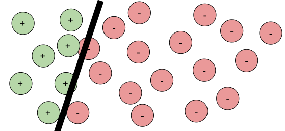
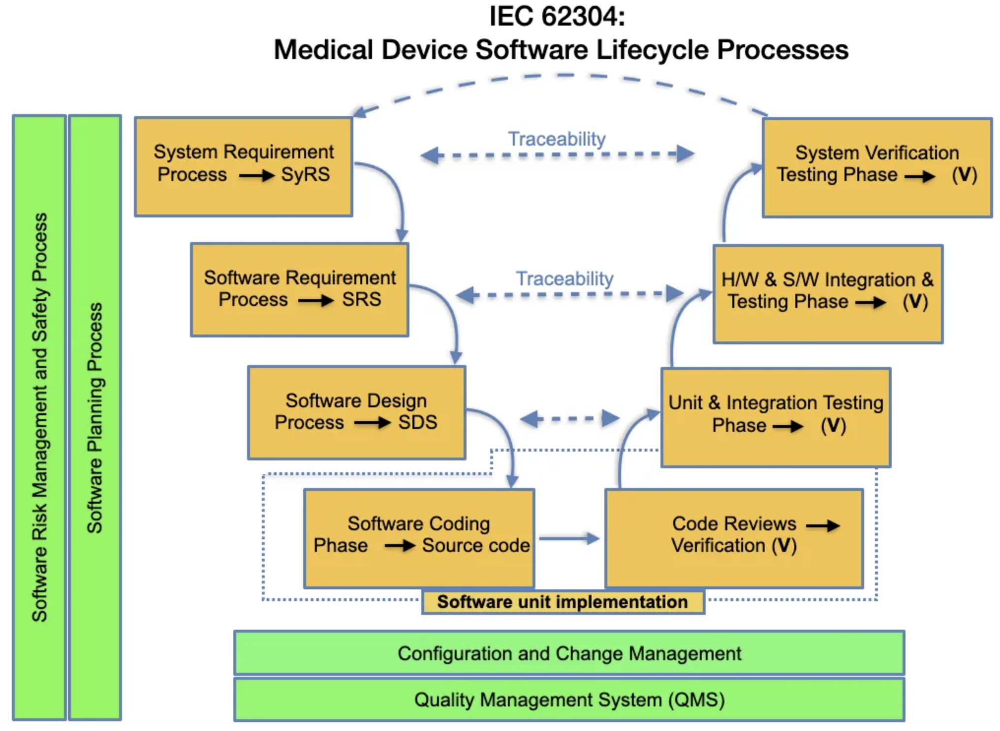
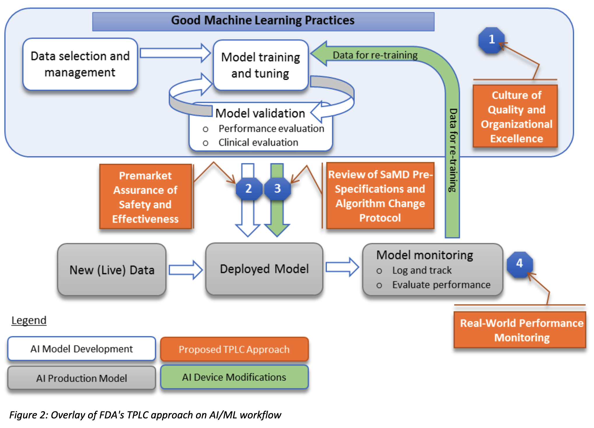
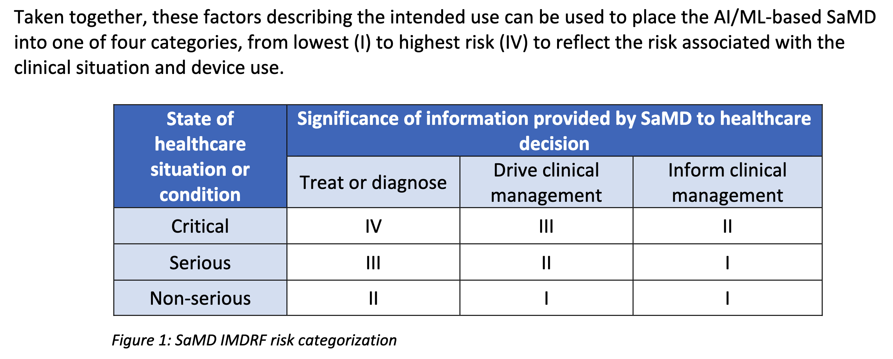
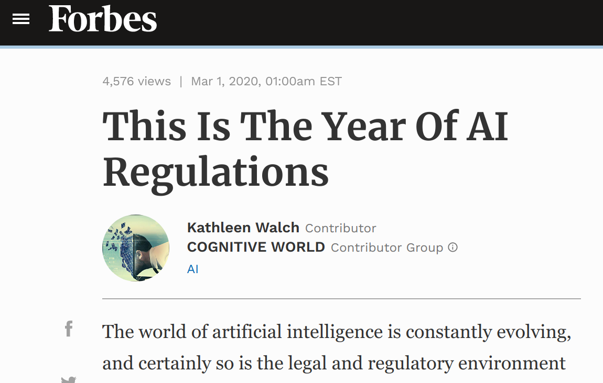
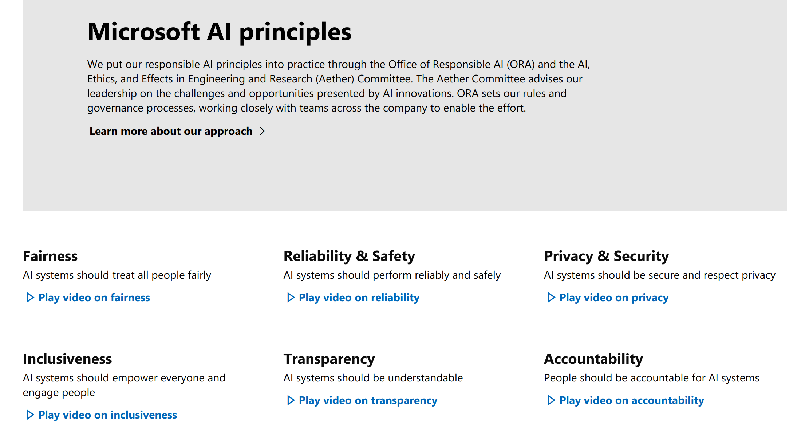
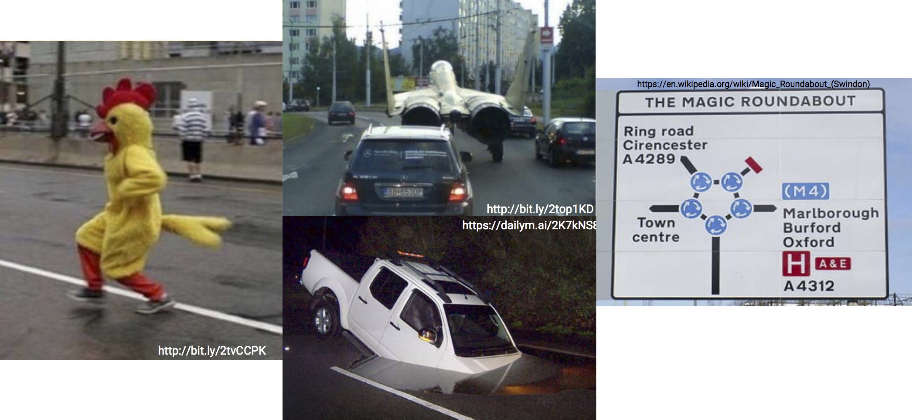

# Administrativa

* Second midterm during Dec 4 lecture
  * Same style/format as first midterm (scenario driven; focus on isses you had opportunities to practice; same notes policy)
  * Not cummulative: Only covering materials after first midterm (lectures, readings, assignments, ...)
* Last milestone M4 deadline extension to Friday Dec 6

---
## Mitigating more mistakes...

<!-- .element: class="plain stretch" -->

----
## Reading

S. Mohseni et al., [Practical Solutions for Machine Learning Safety in Autonomous Vehicles](http://ceur-ws.org/Vol-2560/paper40.pdf).
SafeAI Workshop@AAAI (2020).

---
## Learning Goals

* Understand safety concerns in traditional and AI-enabled systems
* Understand the importance of ML robustness for safety
* Apply hazard analysis to identify risks and requirements and understand their limitations
* Discuss ways to design systems to be safe against potential failures 
* Suggest safety assurance strategies for a specific project
* Describe the typical processes for safety evaluations and their limitations

---
# AI Safety

 
<!-- references -->
Amodei, Dario, Chris Olah, Jacob Steinhardt, Paul Christiano, John Schulman, and Dan Mané. "[Concrete problems in AI safety](https://arxiv.org/pdf/1606.06565.pdf%20http://arxiv.org/abs/1606.06565)." arXiv preprint arXiv:1606.06565 (2016).

----
## Your Favorite AI Dystopia?

<!-- discussion -->

----
## Existential AI Risk

Funding through *longtermism* branch of effective altruism *(Longtermism is the view that positively influencing the longterm future is a key moral priority of our time.)*

Ord estimates 10% existential risk from unaligned AI in 100 years
* "Unaligned AI" here = AI that does not share human values
* There are other alignment problems (e.g. on functional expectations)

**Our view:** Existential AI risk not a real concern for the kind of ML-enabled products we consider here

<!-- references -->
Ord, Toby. The precipice: Existential risk and the future of humanity. Hachette Books, 2020.

Note: Relevant for reinforcement learning and AGI

----
## More pressing AI isks?

<!-- .element: class="stretch" -->

> “Those hypothetical risks are the focus of a dangerous ideology
called longtermism that ignores the actual harms resulting from the
deployment of AI systems today,” they wrote, citing worker
exploitation, data theft, synthetic media that props up existing power
structures and the further concentration of those power structures in
fewer hands.

----
## The AI Alignment Problem

AI is optimized for a specific objective/cost function
  * Inadvertently cause undesirable effects on the environment
  * e.g., [Transport robot](https://www.youtube.com/watch?v=JzlsvFN_5HI): Move a box to a specific destination
  * Side effects: Scratch furniture, bump into humans, etc.,
 
Side effects may cause ethical/safety issues (e.g., social media optimizing for clicks, causing teen depression)

Difficult to define sensible fitness functions:
  * Perform X *subject to common-sense constr. on the
    environment*
  * Perform X *but avoid side effects to the extent
      possible*

----
## Reward Hacking

> PlayFun algorithm pauses the game of Tetris indefinitely to avoid losing  

> When about to lose a hockey game, the PlayFun algorithm exploits a bug to make one of the players on the opposing team disappear from the map, thus forcing a draw.

> Self-driving car rewarded for speed learns to spin in circles  

[Example: Coast Runner](https://www.youtube.com/watch?v=tlOIHko8ySg)

----
## "Reward hacking" in LLM Agents

<!-- .element: class="stretch plain" -->

<!-- references_ -->
Ruan, Yangjun, et al. "Identifying the risks of lm agents with an lm-emulated sandbox." arXiv 2023

----
## Reward Hacking

* AI can be good at finding loopholes to achieve a goal in unintended ways
* Technically correct, but does not follow *designer's informal intent*
* Many possible causes, incl. partially observed goals, abstract rewards, feedback loops
* In general, a very challenging problem!
  * Difficult to specify goal & reward function to avoid all
  possible hacks
  * Requires careful engineering and iterative reward design

<!-- references -->
Amodei, Dario, Chris Olah, Jacob Steinhardt, Paul Christiano, John Schulman, and Dan Mané. "[Concrete problems in AI safety](https://arxiv.org/pdf/1606.06565.pdf%20http://arxiv.org/abs/1606.06565)." arXiv preprint arXiv:1606.06565 (2016).

Notes: program repair

----
## AI Alignment Problem = Requirements Problem

Recall: "World vs. machine"
* Identify stakeholders in the environment & possible effects on them
* Anticipate side effects, feedback loops
* Constrain the scope of the system
* Perfect contracts usually infeasible, undesirable

But more requirements engineering unlikely to be only solution

----
## Practical Alignment Problems

Does the model goal align with the system goal? Does the system goal align with the user's goals?
* Profits (max. accuracy) vs fairness
* Engagement (ad sales) vs enjoyment, mental health
* Accuracy vs operating costs

Test model *and* system quality *in production*

(see requirements engineering and architecture lectures)

---

# System Safety

----
## Defining Safety

Prevention of a system failure or malfunction that results in:
  * Death or serious injury to people
  * Loss or severe damage to equipment/property
  * Harm to the environment or society

Safety is a system concept
  * Can't talk about software/ML being "safe"/"unsafe" on its own
  * Safety is defined in terms of its effect on the **environment**

----
## Recall: LLM agent unsable to your env

<!-- .element: class="stretch plain" -->

<!-- references_ -->
Ruan, Yangjun, et al. "Identifying the risks of lm agents with an lm-emulated sandbox." arXiv 2023

----
## Systems can be unsafe in unexpected ways

Notes: Systems can be unsafe in unexpected ways

----
## Concept: Safety != Reliability

* Reliability = absence of defects, mean time between failure
* Safety = prevents accidents, harms
* 
* Can build safe systems from unreliable components (e.g. redundancy, safeguards)
* System may be unsafe despite reliable components (e.g. stronger gas tank causes more severe damage in incident)

_Accuracy is usually about reliability!_

----
## Safety is a broad concept

Recall: Legal vs ethical

Safety analysis not only for regulated domains (nuclear power plants, medical devices, planes, cars, ...), and includes harms beyond physical harms/injury

Many end-user applications have a safety component 

Start with requirements and hazard analyses

Notes: Do the right thing, even without regulation

---
# Robustness 

----
## Why robustness matters for safety

Environment sometimes __deviates__ from expected, normal conditions
- Extreme weathers, unexpected obstacles, etc., 
- Erratic user behaviors; unusually high service demand
- Adversarial actors; users trying to game your system, etc., 

Does your system work reasonably well under these deviations? i.e., is
it _robust_?

Most safety-critical systems require some level of robustness
- Not enough to show that system is safe in normal conditions

----
## Defining Robustness for ML

> A prediction for input $x$ is robust if the outcome is stable under
minor perturbations to the input:
> 
> $\forall x'. d(x, x')<\epsilon \Rightarrow f(x) = f(x')$
>
> distance function $d$ and permissible distance $\epsilon$ depends on the problem domain!

* A model is said to be robust if most predictions are robust
* An important concept in safety and security settings
  * In safety, perturbations tend to be random or predictable (e.g.,
  sensor noise due to weather conditions)
  * In security, perturbations are intentionally crafted (e.g.,
    adversarial attacks)

----
## Robustness and Distance for Images

+ Slight rotation, stretching, or other transformations
+ Change many pixels minimally (below human perception)
+ Change only few pixels
+ Change most pixels mostly uniformly, e.g., brightness

<!-- .element: class="stretch" -->

<!-- references_ -->
Image: [_An abstract domain for certifying neural networks_](https://dl.acm.org/doi/pdf/10.1145/3290354).
    Gagandeep et al., POPL (2019).

----
## No Model is Fully Robust

* Every useful model has at least one decision boundary
* Predictions near that boundary are not (and should not) be robust

<!-- .element: class="stretch" -->

----
## Evaluating ML Robustness

* Lots of on-going research (especially for DNNs)
* Formal verification
  - Constraint solving or abstract interpretation over computations in neuron activations
  - Conservative abstraction, may label robust inputs as not robust
  - Currently not very scalable
  - Example: [_An abstract domain for certifying neural networks_](https://dl.acm.org/doi/pdf/10.1145/3290354).
    Gagandeep et al., POPL (2019).
* Sampling
    - Sample within distance, compare prediction to majority prediction
  - Probabilistic guarantees possible (with many queries, e.g., 100k)
  - Example:
    [_Certified adversarial robustness via randomized smoothing_](https://arxiv.org/abs/1902.02918). Cohen,
    Rosenfeld, and Kolter, ICML (2019).

----
## ML Robustness: Limitations

* Lots of on-going research (especially for DNNs)
* Mostly input-centric, focusing on small ($\epsilon$) perburtations
  * Common use case: Robustness against adversarial attacks
  * Q. But do these pertubations matter for safety?
* In practice: Perturbations result from environmental changes! 
  * Which parts of the world does the software sense?
  * Can those parts change over time? Can the sensors be noisy,
  faulty, etc.,? (these are **domain-specific**)
  * What input pertburbations could be caused by from these changes/noise...?

----
## Robustness testing

Evaluates the degree to which a system or component functions correctly in the
presence of invalid inputs or stressful or off-nominal environmental conditions.

Notes: this has a rich history outside of ML!

----
## Robustness in a Safety Setting

* Does the model detect stop signs under normal conditions?
* Does the model detect stop signs under deviations?
  * __Q. What deviations do we care about?__

<!-- .element: class="stretch" -->

----
## Robustness in a Safety Setting

* Does the model detect stop signs under normal conditions?
* Does the model detect stop signs under deviations?
  * Poor lighting? In fog? With a tilted camera? Sensor noise?
  * With stickers taped to the sign? 

<!-- .element: class="stretch" -->

<!-- references_ -->
Image: David Silver. [Adversarial Traffic Signs](https://medium.com/self-driving-cars/adversarial-traffic-signs-fd16b7171906). Blog post, 2017

----
## Improving Robustness for Safety

Q. How do we make ML-based systems more robust?

<!-- discussion -->

----
## Improving Robustness for Safety

<!-- .element: class="stretch" -->

Learn more robust models
  - Test/think about domain-specific deviations that might result in
    perturbations to model input (e.g., 
    fogs, snow, sensor noise)
  - Curate data for those abnormal scenarios or augment training data with transformed inputs

<!-- references_ -->
_Automated driving recognition technologies for adverse weather
conditions._ Yoneda et al., (2019).

----
## Improving Robustness for Safety 

<!-- .element: class="stretch" -->

Design mechanisms (on system level)
  - Deploy redundant components for critical tasks (e.g., vision + map)
  - Ensemble learning: Combine models with different biases
  - Multiple, independent sensors (e.g., LiDAR + radar + cameras)

----
## Improving Robustness for Safety

Design mechanisms (on system level)
  - Deploy redundant components for critical tasks (e.g., vision + map)
  - Ensemble learning: Combine models with different biases
  - Multiple, independent sensors (e.g., LiDAR + radar + cameras)
  
Robustness checking at inference time 
  - Handle inputs with non-robust predictions differently
    (e.g. discard or output low confidence score for outliers)
  - Downside: Raises cost of prediction; may not be suitable
    for time-sensitive applications (e.g., self-driving cars)

----
## Breakout: Robustness

Scenario: Medical use of transcription service, dictate diagnoses and prescriptions

As a group, tagging members, post to `#lecture`:

> 1. What safety concerns can you anticipate?
> 2. What deviations are you concerned about?
> 3. How would you improve the robustness of the overall system?

---
# Demonstrating and Documenting Safety

__How do we demonstrate to a third-party that our system is safe?__

----
## Demonstrating Safety

Two main strategies:

1. **Evidence of safe behavior in the field** 
   * Extensive field trials
   * Usually expensive
2. **Evidence of responsible (safety) engineering process**
   * Process with hazard analysis, testing mitigations, etc
   * Not sufficient to assure safety
  

----
## Safety & Certification Standards

* Guidelines & recommendations for achieving an acceptable level of safety
  * Examples: DO-178C (airborne systems), ISO 26262 (automotive), IEC 62304 (medical
software), Common Criteria (security)
* Most standards require both safety engineering process & evidence of safe behavior
* Typically, **prescriptive & process-oriented**
  * Recommends use of certain development processes
  * Requirements specification, design, hazard analysis, testing, verification, configuration management, etc.

----
## Certification Standards: Example

<!-- .element: class="stretch" -->

----
## Safety & Certification Standards

* Limitations
	* Most not designed to handle ML systems (exception: UL 4600)
	* Costly to satisfy & certify, but effectiveness unclear (e.g., many
    FDA-certified products recalled due to safety incidents)

Good processes are important, but not sufficient; provides only indirect evidence for system safety. It is possible to have a well-documented process that still produces an unsafe system!

----
## Evidence of Safe Behavior in the field

<!-- .element: class="stretch" -->

----
## Recent dev: AI/ML related regulation

<!-- .element: class="stretch plain" -->

<!-- references_ -->
FDA. [Proposed Regulatory Framework for Modifications to Artificial Intelligence/Machine Learning (AI/ML)-Based Software as a Medical Device (SaMD)](https://www.fda.gov/files/medical%20devices/published/US-FDA-Artificial-Intelligence-and-Machine-Learning-Discussion-Paper.pdf). Discussion paper, 2021.

----
## Recent dev: AI/ML related regulation

<!-- .element: class="stretch plain" -->

----
## FDA: Risk-based Approach

<!-- .element: class="stretch plain" -->

----
## Demonstrating Safety

Two main strategies:

1. **Evidence of safe behavior in the field** 
   * Extensive field trials
   * Usually expensive
2. **Evidence of responsible (safety) engineering process**
   * Process with hazard analysis, testing mitigations, etc
   * Not sufficient to assure safety

**Most standards require both**

**But still not sufficient!**

----
## Assurance (Safety) Cases

An emerging approach to demonstrating safety

* An explicit argument that a system achieves a desired safety
requirement, along with supporting evidence
* Structure:
  * `Argument`: A top-level claim decomposed into multiple sub-claims
  * `Evidence`: Testing, software analysis, formal verification,
  inspection, expert opinions, design mechanisms...

----
## Assurance Cases: Example

<!-- .element: class="stretch plain" -->

Remind you of anything?

----
## Assurance Cases: Example

<!-- .element: class="stretch plain " -->

Questions to think about:
  * Do sub-claims imply the parent claim?
  * Am I missing any sub-claims?
  * Is the evidence strong enough to discharge a leaf claim?

----
## Assurance Cases: Example

<!-- .element: class="stretch plain" -->

[Aurora Safety Case](https://aurora.tech/blog/aurora-unveils-first-ever-safety-case-framework)

----
## Discussion: Assurance Case for Recommender

<!-- .element: class="stretch" -->

How would you argue that your recommendation system
provides at least 95% availability? What evidence would you provide? 

----
## Assurance Cases: Benefits & Limitations

* Provides an explicit structure to the safety argument
  * Easier to navigate, inspect, and refute for third-party auditors
  * Provides traceability between system-level claims &
    low-level evidence
  * Can also be used for other types of system quality (security,
    reliability, etc.,)
* Challenges and pitfalls
  * Informal links between claims & evidence, e.g., Does the sub-claims actually imply the top-level claim? 
  * Effort in constructing the case & evidence: How much evidence is enough?
  * System evolution: If system changes, must reproduce the case & evidence
* Tools for building & analyzing safety cases available
	* e.g., [ASCE/GSN](https://www.adelard.com/gsn.html) from Adelard
	* But ultimately, can't replace domain knowledge & critical thinking

----
## Unique safety challenges for AI systems

* Safe Exploration
  - Exploratory actions "in production" may have consequences
  - e.g., trap robots, crash drones, AI agents that retry actions
* Robustness to Drift
    - Drift may lead to poor performance that may not even be recognized
* Scalable Oversight
    - Cannot provide human oversight over every action (or label all possible training data)
  - Use indirect proxies in telemetry to assess success/satisfaction

<!-- references -->
Amodei, Dario, Chris Olah, Jacob Steinhardt, Paul Christiano, John Schulman, and Dan Mané. "[Concrete problems in AI safety](https://arxiv.org/pdf/1606.06565.pdf%20http://arxiv.org/abs/1606.06565)." arXiv preprint arXiv:1606.06565 (2016).

---
# (Self-)Regulation and Policy

----

----
## “Accelerating America’s Leadership in Artificial Intelligence”

> “the policy of the United States Government [is] to sustain and enhance the scientific, technological, and economic leadership position of the United States in AI.” -- [White House Executive Order Feb. 2019](https://www.whitehouse.gov/articles/accelerating-americas-leadership-in-artificial-intelligence/)

Tone: "When in doubt, the government should not regulate AI."

Note:
* 3. Setting AI Governance Standards: "*foster public trust in AI systems by establishing guidance for AI development. [...] help Federal regulatory agencies develop and maintain approaches for the safe and trustworthy creation and adoption of new AI technologies. [...] NIST to lead the development of appropriate technical standards for reliable, robust, trustworthy, secure, portable, and interoperable AI systems.*"

----
## EU AI Act

Broad regulatory framework, passed March 13, 2024

Risk-based framework:
* Unacceptable risk: Banned applications for social scoring, cognitive manipulation, real-time biometric surveillance, ...
* High risk: Registration, (ongoing) risk assessment, data governance, monitoring, documentation, transparency, human oversight, and assurances for robustness, security, and accuracy for applications for hiring, health, law enforcement, ...
* Limited risk: Limited transparency (model's existence) obligations, e.g., image generation
* Minimal risk: Not regulated, e.g., video games, spam filters

----
## 2023 WH Executive Order on the Safe, Secure, and Trustworthy Development and Use of Artificial Intelligence

Instructs agencies to study risks and develop standards

Broad scope, touches on quality assurance standards (incl. red teaming) and marking AI-generated content

Domain-specific guidelines for chemical, biological, radiological, nuclear, and cybersecurity risks to be explored

Committees, reports, guidance, research instead of enforceable rules

----
## Call for Transparent and Audited Models

> "no black box should be deployed
when there exists an interpretable model with the same level of performance"

For high-stakes decisions
* ... with government involvement (recidivism, policing, city planning, ...)
* ... in medicine
* ... with discrimination concerns (hiring, loans, housing, ...)
* ... that influence society and discourse? (algorithmic content amplifications, targeted advertisement, ...)

*Regulate possible conflict: Intellectual property vs public welfare*

<!-- references -->

Rudin, Cynthia. "Stop explaining black box machine learning models for high stakes decisions and use interpretable models instead." Nature Machine Intelligence 1.5 (2019): 206-215. ([Preprint](https://arxiv.org/abs/1811.10154))

----

----

----
## Policy Discussion and Frameing

* Corporate pitch: "Responsible AI" ([Microsoft](https://www.microsoft.com/en-us/ai/responsible-ai), [Google](https://ai.google/responsibilities/responsible-ai-practices/), [Accenture](https://www.accenture.com/_acnmedia/pdf-92/accenture-afs-responsible-ai.pdf))
* Counterpoint: Ochigame ["The Invention of 'Ethical AI': How Big Tech Manipulates Academia to Avoid Regulation"](https://theintercept.com/2019/12/20/mit-ethical-ai-artificial-intelligence/), The Intercept 2019
  - "*The discourse of “ethical AI” was aligned strategically with a Silicon Valley effort seeking to avoid legally enforceable restrictions of controversial technologies.*"

**Self-regulation vs government regulation? Assuring safety vs fostering innovation?**

----

----

----
# "Wishful Worries"

We are distracted with worries about fairness and safety of hypothetical systems

Most systems fail because they didn't work in the first place; don't actually solve a problem or address impossible tasks

Wouldn't help even if they solved the given problem (e.g., predictive policing?)

<!-- references -->

Raji, Inioluwa Deborah, I. Elizabeth Kumar, Aaron Horowitz, and Andrew Selbst. "The fallacy of AI functionality." In 2022 ACM Conference on Fairness, Accountability, and Transparency, pp. 959-972. 2022.

----
## Criticism: Ethics Washing, Ethics Bashing, Regulatory Capture

<!-- discussion -->

---
# Summary

* Defining safety: absence of harm to people, property, and environment -- consider broadly; safety != reliability
* *Adopt a safety mindset!*
* Assume all components will eventually fail in one way or another, especially ML components
* Hazard analysis to identify safety risks and requirements; classic
safety design at the system level
* Robustness: Identify & address relevant deviations
* AI alignment: AI goals are difficult to specify precisely; susceptible to negative
  side effect & reward hacking

----
## Further Readings

* Borg, Markus, Cristofer Englund, Krzysztof Wnuk, Boris Duran, Christoffer Levandowski, Shenjian Gao, Yanwen Tan, Henrik Kaijser, Henrik Lönn, and Jonas Törnqvist. “[Safely entering the deep: A review of verification and validation for machine learning and a challenge elicitation in the automotive industry](https://www.atlantis-press.com/journals/jase/125905766).” Journal of Automotive Software Engineering. 2019
* Leveson, Nancy G. [Engineering a safer world: Systems thinking applied to safety](https://direct.mit.edu/books/book/2908/Engineering-a-Safer-WorldSystems-Thinking-Applied). The MIT Press, 2016.
* Salay, Rick, and Krzysztof Czarnecki. “[Using machine learning safely in automotive software: An assessment and adaption of software process requirements in ISO 26262](https://arxiv.org/pdf/1808.01614).” arXiv preprint arXiv:1808.01614 (2018).
* Mohseni, Sina, Mandar Pitale, Vasu Singh, and Zhangyang Wang. “[Practical Solutions for Machine Learning Safety in Autonomous Vehicles](https://arxiv.org/abs/1912.09630).” SafeAI workshop at AAAI’20, (2020).
* Huang, Xiaowei, Daniel Kroening, Wenjie Ruan, James Sharp, Youcheng Sun, Emese Thamo, Min Wu, and Xinping Yi. “[A survey of safety and trustworthiness of deep neural networks: Verification, testing, adversarial attack and defence, and interpretability](https://arxiv.org/abs/1812.08342).” Computer Science Review 37 (2020).
* Amodei, Dario, Chris Olah, Jacob Steinhardt, Paul Christiano, John Schulman, and Dan Mané. "[Concrete problems in AI safety](https://arxiv.org/pdf/1606.06565.pdf)." arXiv preprint arXiv:1606.06565 (2016).

---
# Safety Engineering

----
## Safety Engineering

Safety Engineering: An engineering discipline which assures that engineered systems provide acceptable levels of safety.

Typical safety engineering process:
  * Identify relevant hazards & safety requirements
  * Identify potential root causes for hazards
  * For each hazard, develop a mitigation strategy
  * Provide evidence that mitigations are properly implemented

----
## Case Study: Self-Driving Car

----
## How did traditional vehicles become safer?

<!-- colstart -->

<!-- .element: class="stretch" -->

<!-- col -->

National Traffic & Motor Safety Act (1966): 
* Mandatory design changes (head rests, shatter-resistant windshields, safety belts)
* Road improvements (center lines, reflectors, guardrails)
* Significant reduction (13-46%) in traffic fatalities 

<!-- colend -->

----
## Autonomous Vehicles: What's different?

<!-- .element: class="stretch" -->

* In traditional vehicles, humans ultimately responsible for safety
  * Built-in safety features (lane keeping, emergency braking) 
  * i.e., safety = human control + safety mechanisms
* Use of AI in autonomous vehicles: Perception, control, routing,
etc.,
  * Inductive training: No explicit requirements or design insights
  * __Can ML achieve safe design solely through lots of data?__

----
## Demonstrating Safety

<!-- .element: class="stretch" -->

__Q. More miles tested => safer?__

----
## Challenge: Edge/Unknown Cases

<!-- .element: class="stretch" -->

* Gaps in training data; ML unlikely to cover all unknown cases
* Is this a unique problem for AI? What about humans?

----
## Improving Safety of ML-Enabled Systems

Anticipate problems (hazard analysis, FTA, FMEA, HAZOP, ...)

Anticipate the existence of unanticipated problems

Plan for mistakes, design mitigations (recall earlier lecture!)
* Human in the loop
* Undoable actions, failsoft
* Guardrails
* Mistaked detection
* Redundancy, ...

---
# FMEA

----
## Reminder: Fault-Tree Analysis 

* Town-down, *backward* search for the root cause of issues
    - from final outcomes to initiating events
* Issues (TOP events) need to be known upfront
* Quantitative analysis possible
* Useful for understanding faults post-hoc
* Where do outcomes come from?

----
## Failure Mode and Effects Analysis (FMEA)

<!-- .element: class="stretch" -->

* A __forward search__ technique to identify potential hazards
* Widely used in aeronautics, automotive, healthcare, food services,
  semiconductor processing, and (to some extent) software

----
## FMEA Process

(a) Identify system components

(b) Enumerate potential failure modes
  * *for ML component: Always suspect prediction may be wrong*

(c) For each failure mode, identify:
  * Potential hazardous effect on the system
  * Method for detecting the failure
  * Potential mitigation strategy

----
## FMEA Excerpt: Autonomous Car

<!-- references -->

Excerpt of an FMEA table for analyzing components in an autonomous vehicle, from  David Robert Beachum. Methods for assessing the safety of autonomous vehicles. University of Texas Theses and Dissertations (2019).

----
## "Wrong Prediction" as Failure Mode?

"Wrong prediction" is a very cause grained failure mode of every model

May not be possible to decompose further

However, may evaluate causes of wrong prediction for better understanding, as far as possible --> FTA?

----
## FMEA Summary

Forward analysis: From components to possible failures

Focus on single component failures, no interactions

Identifying failure modes may require domain understanding

---
# HAZOP

----
## Hazard and Interoperability Study (HAZOP)
   
*Identify hazards and component fault scenarios through guided inspection of requirements*

----
## Hazard and Operability Study (HAZOP)

<!-- colstart -->

A __forward search__ method to identify potential hazards

For each component, use a set of __guide words__ to generate
possible deviations from expected behavior

Consider the impact of each generated deviation: Can it result in a system-level hazard?

<!-- col -->

<!-- colend -->

----
## HAZOP Example: Emergency Braking (EB)

<!-- colstart -->

Specification: EB must apply a maximum braking command to the engine.

  * __NO OR NOT__: EB does not generate any braking command.
  * __LESS__: EB applies less than max. braking.
  * __LATE__: EB applies max. braking but after a delay of 2
  seconds.
  * __REVERSE__: EB generates an acceleration command instead of braking.
  * __BEFORE__: EB applies max. braking before a possible crash is detected.

<!-- col -->

<!-- colend -->

----
## HAZOP & ML

In addition to traditional analysis:
Analyze possible mistakes of all ML components

Original guidewords:
NO OR NOT,
MORE,
LESS,
AS WELL AS,
PART OF,
REVERSE,
OTHER THAN / INSTEAD,
EARLY,
LATE,
BEFORE,
AFTER

Additional ML-specific guidewords: WRONG, INVALID, INCOMPLETE, PERTURBED, and INCAPABLE.

----
## Breakout: Automated Train Doors

Analyze the vision component to detect obstacles in train doors

NO OR NOT,
MORE,
LESS,
AS WELL AS,
PART OF,
REVERSE,
OTHER THAN / INSTEAD,
EARLY,
LATE,
BEFORE,
AFTER, WRONG, INVALID, INCOMPLETE, PERTURBED, and INCAPABLE.

Using HAZOP: As a group answer in `#lecture`, tagging group members:

> * What is the specification of the perception component? 
> * What are possible deviations from the specification?
> * What are potential hazards resulting from these deviations?
> * What possible mitigations would you consider? (e.g., human in the loop, undoable actions, guardrails, mistake detection and recovery, containment)

----
## HAZOP: Benefits & Limitations

* Easy to use; encourages systematic reasoning about component faults
* Can be combined with FTA/FMEA to generate faults (i.e., basic
events in FTA)
* Potentially labor-intensive; relies on engineer's judgement
* Does not guarantee to find all hazards (but also true for other techniques)

----
## Remarks: Hazard Analysis

None of these methods guarantee completeness
  * You may still be missing important hazards, failure modes

Intended as structured approaches to thinking about failures
  * But cannot replace human expertise and experience

---
# Designing for Safety

See Lecture **Planning for Mistakes**

----
## Safety Assurance with ML Components

* Consider ML components as unreliable, at most probabilistic guarantees
* Testing, testing, testing (+ simulation)
  - Focus on data quality & robustness
* *Adopt a system-level perspective!*
* Consider safe system design with unreliable components
  - Traditional systems and safety engineering
  - Assurance cases
* Understand the problem and the hazards
  - System level, goals, hazard analysis, world vs machine
  - Specify *end-to-end system behavior* if feasible

